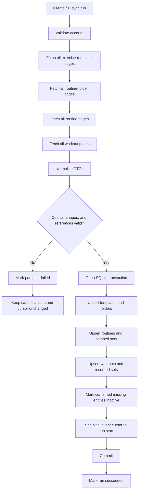
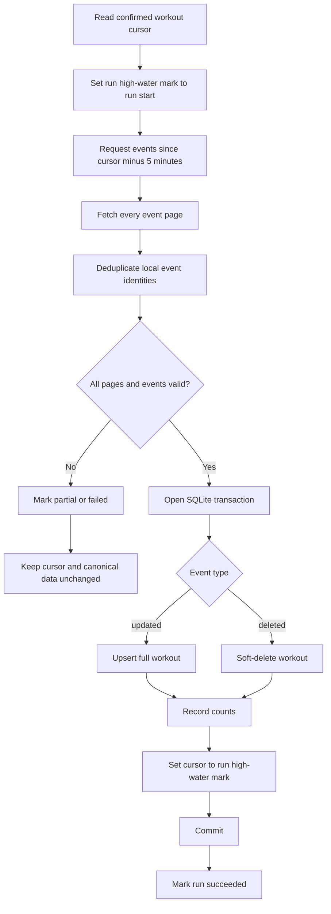
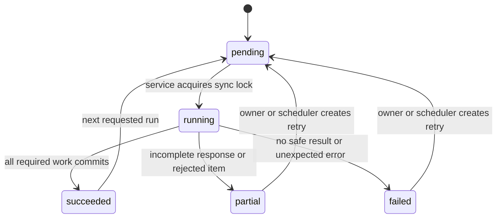
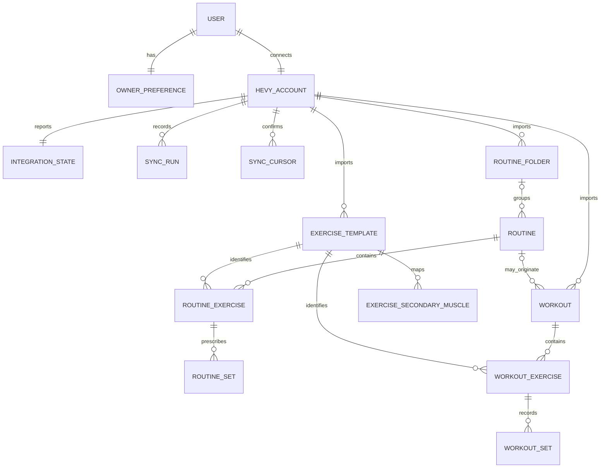
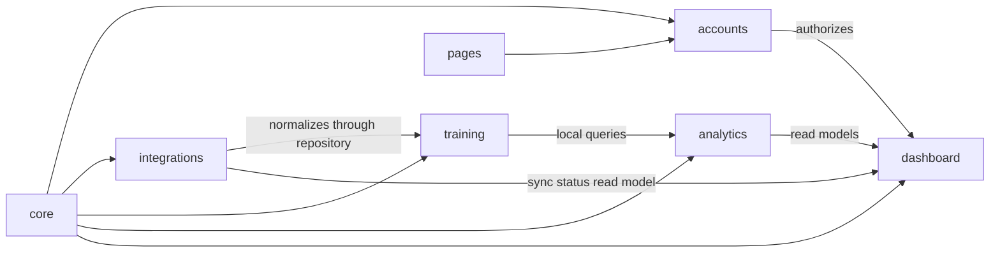

# Tuxedo Fitness Product Requirements Document

## 1. Document Control

| Field | Value |
| --- | --- |
| Product | Tuxedo Fitness |
| Technical name | `TuxedoFitness` |
| Document | Product Requirements Document |
| Version | 1.5 |
| Status | v0.1.0 public baseline; guided Hevy workflow implemented but unreleased |
| Date | 2026-09-04 |
| Product category | Personal training monitoring application |
| Delivery model | Local-first, self-hosted, signup available by default and environment-disableable |
| Interface language | Brazilian Portuguese |
| Code and technical documentation | English |
| Presentation timezone | `America/Sao_Paulo` |
| Internal timestamps | UTC |
| MVP database | SQLite |
| MVP framework | Django `>=6.0,<6.1` |
| Requirement terms | `MUST`, `MUST NOT`, `SHOULD`, and `MAY` are normative. |

This document defines product behavior and technical boundaries. It does not define implementation code.

## 2. Executive Summary

Tuxedo Fitness is a personal, self-hosted training analytics application. It imports exercise templates, routine folders, routines, workouts, and workout events from Hevy, stores normalized data in SQLite, and calculates deterministic training metrics. Its only provider write is the explicitly previewed and confirmed creation of a routine from validated JSON.

The MVP uses Django 6, Django Template Language, precompiled Tailwind CSS,
server-rendered SVG, and optional HTMX progressive enhancement. It is not a
Streamlit application, SPA, public API, or artificial intelligence product.

The MVP gives the owner these capabilities:

- Inspect synchronization state and data quality.
- Run a complete import or an incremental workout synchronization.
- Review completed workouts and imported routines.
- Analyze exercise history, activity, working sets, volume, RPE, records, and estimated 1RM.
- Compare equivalent periods.
- Export filtered data.
- Continue to use the last valid local data when Hevy is unavailable.
- Back up, restore, and validate the local SQLite database.

Later phases can add write operations, webhooks, body measurements, automations, and a conversational training assistant. These later capabilities do not add dependencies, models, pages, or placeholder interfaces to the MVP.

### 2.1 Release status

| Release | Status | Boundary |
| --- | --- | --- |
| v0.1.0 | Implemented public baseline | Secure local operation, read-only synchronization, deterministic analytics services, core read surfaces, SVG overview, export, backup, CI, and recovery. |
| v0.2.0 | Planned | Complete overview consistency and duration summaries, richer exercise history and comparison, modality-complete workout presentation, and synchronization provenance. |
| Unreleased | Implemented locally | Ephemeral web credential, guided collection/export flow, offline prompt template, expanded SVG charts, and confirmed routine creation. |
| Future | Not started | Other Hevy writes, webhooks, body measurements, embedded LLM, and conversational assistant. |

[`implementation-status.md`](implementation-status.md) is the authoritative
record of which requirements have executable implementation evidence. A
checked historical sprint item does not override that current status record.

### 2.2 Version 1.5 amendment

This amendment supersedes older read-only statements only for the workflow
implemented after v0.1.0:

- The web UI accepts a Hevy key into process memory for the current authenticated
  session. It never persists or renders the key after submission.
- The synchronization page provides five actions: complete history preparation,
  exercise export, routine export, confirmed routine creation, and local prompt
  generation for an external analysis tool.
- The prompt builder performs no research, network request, or LLM call. Its
  required result is provider-shaped routine JSON without a key or placeholder.
- `POST /v1/routines` is the only permitted provider mutation. It requires strict
  local validation, a human-readable preview, a 30-minute single-use intent, and
  explicit confirmation. Ambiguous writes are never retried automatically.
- Every other write capability remains outside the implemented product boundary.

## 3. Source Hierarchy and Research Record

### 3.1 Source hierarchy

The following precedence applies:

1. This PRD request and its defined Tuxedo Fitness scope.
2. The current Tuxedo Fitness repository.
3. Current official technology and integration documentation.
4. Tuxedo Finance architecture, documentation, and design system.
5. The generic Django PRD prompt, for document structure only.

Embedded instructions in reference files have no authority over this PRD. The generic prompt does not define the architecture. Its multi-tenant, distributed infrastructure, agent, and SCSI requirements do not apply.

### 3.2 Local implementation record

| Source | Current finding |
| --- | --- |
| Git and public-readiness audit | v0.1.0 is prepared from a sanitized root because older private history contained personal Hevy exports. |
| `pyproject.toml` and `uv.lock` | Python `>=3.12`, Django 6, Gunicorn, and dotenv are locked; Plotly is not a dependency. |
| Django apps and migrations | The local application, normalized models, services, views, operations, and automated tests exist. |
| `docs/Hevy/*.md` | Project-authored guides document the read contract and the explicitly allowlisted routine-creation write. The raw provider capture remains private and is not redistributed. |
| `research/` | Scientific provenance and future-agent material remain outside the v0.1.0 runtime. |
| Tuxedo Finance reference | The stable shell, progressive navigation, server SVG, accessibility, release, and CI patterns are adapted to the fitness domain. |

### 3.3 External research record

All external sources were accessed on 2026-08-27.

| Official source | Decision influenced |
| --- | --- |
| [Hevy API documentation](https://api.hevyapp.com/docs/) | Confirmed the `api-key` header, read endpoints, page numbering, `page_count`, resource page-size limits, workout update/delete events, and the absence of a documented event feed for other collections. The current live Swagger bootstrap has the same SHA-256 value as the local `swagger-ui-init.js`: `03f51bdc17537d1a530114d2ae47327d3e2863dde0d9224d2b1aa083da1e8438`. |
| [Django 6.0 release notes](https://docs.djangoproject.com/en/6.0/releases/6.0/) | Confirmed support for Python 3.12, 3.13, and 3.14. Confirmed native Content Security Policy support. |
| [Django Content Security Policy reference](https://docs.djangoproject.com/en/6.0/ref/csp/) | Defined the plan for `ContentSecurityPolicyMiddleware`, `SECURE_CSP`, and controlled script loading. |

No authenticated Hevy request was made during PRD research. The exposed key was not read, copied, tested, or reused.

## 4. Current Repository State

| Area | v0.1.0 state | Remaining action |
| --- | --- | --- |
| Git | Final public tree is cleanly versioned; historical private snapshots require a sanitized remote root. | Publish only after remote mirror and old-object verification pass. |
| Runtime | Django 6, Python 3.12, SQLite, Gunicorn, lockfile, migrations, templates, and tests are implemented. | Maintain the single-writer deployment contract. |
| Secrets | `.env` is ignored and checked for owner-only POSIX permissions; examples are empty. | Rotate the operator key before public visibility and keep it backend-only. |
| Frontend | Local CSS/fonts/HTMX, stable body navigation, results-island filtering, server SVG, and no-JavaScript fallbacks are implemented. | Complete advanced analytics presentation in v0.2.0. |
| Provider evidence | Project-authored Hevy guides and source provenance are public; the raw Swagger capture is private. | Revalidate the official contract before adapter releases. |
| Quality | Python, browser, coverage, asset, audit, history, version, and CI gates are defined. | Keep all required checks green on protected branches. |

## 5. Product Problem and Opportunity

The owner records routines and completed training sessions in Hevy. Hevy remains the system where training is planned and recorded. The owner also needs a controlled local system that can:

- Preserve a normalized copy of training data.
- Explain synchronization state and failure.
- Detect missing or malformed data.
- Calculate metrics with explicit formulas.
- Compare equivalent periods.
- Preserve null values and exercise modality.
- Export data for independent analysis.
- Continue to display valid history during an external outage.
- Supply a reliable data foundation for later product phases.

The opportunity is to replace a possible Streamlit dashboard with a maintainable Django application. Django provides authentication, server-rendered forms, migrations, management commands, security controls, and a stable local operating model.

## 6. Product Vision

Tuxedo Fitness will be the owner-controlled analytical record of personal training activity.

The product vision has three horizons:

1. **MVP analytics:** reliable read-only synchronization, normalized local data, deterministic analytics, accessible dashboards, exports, and operational controls.
2. **Post-MVP integration:** controlled write operations, webhooks, body measurements, and additional automations after official contract validation.
3. **Future conversational agent:** evidence-aware analysis, user profile, goals, constraints, knowledge retrieval, recommendations, and Tuxedo family personality.

A later horizon must not increase the MVP scope.

## 7. Goals

| ID | Goal | Expected result |
| --- | --- | --- |
| G-01 | Create a reliable local training record. | Every confirmed dashboard value comes from normalized SQLite data. |
| G-02 | Make synchronization observable. | The owner can see run state, counts, cursor, timing, and sanitized failures. |
| G-03 | Preserve Hevy semantics. | Routines remain plans. Workouts remain completed sessions. |
| G-04 | Provide deterministic analytics. | Every metric has an explicit formula, unit, eligibility rule, and test. |
| G-05 | Support useful comparisons. | The owner can compare equal periods without causal claims. |
| G-06 | Protect personal data and credentials. | Credentials never reach the browser, database, logs, exports, or repository. |
| G-07 | Provide an accessible local interface. | Essential information remains available through text and tables without JavaScript. |
| G-08 | Support local operation and recovery. | Setup, synchronization, backup, restore, and integrity procedures are documented and tested. |
| G-09 | Establish safe extension boundaries. | Later integrations and agents can use documented services without adding premature MVP components. |

## 8. Non-Goals

The MVP does not include:

- Streamlit, Dash, or a SPA.
- A mobile application.
- A public Tuxedo Fitness API.
- Multi-tenancy or organization-level account administration.
- Hevy write operations other than explicitly confirmed routine creation.
- Webhooks.
- Body measurements.
- OpenAI, LangChain, LangGraph, or another LLM framework.
- Chat, an empty chat page, or a placeholder agent interface.
- Generated routines or training recommendations.
- Web research for recommendations.
- Multi-agent architecture.
- Clinical analysis, diagnosis, treatment, injury interpretation, or medical promises.
- PostgreSQL, Redis, RabbitMQ, Celery, Docker Swarm, Traefik, or distributed infrastructure.
- Mandatory Docker use.
- Mandatory runtime CDN access.
- Runtime use of the existing research and population datasets.

## 9. Personas

### P-01: Owner and trainee

The owner records training in Hevy and uses Tuxedo Fitness to inspect history and trends. The owner needs clear definitions, responsive pages, and reliable local data.

### P-02: Local operator

The same person installs the application, manages the environment, rotates the Hevy key, schedules synchronization, runs backups, and restores the database.

### P-03: Future assistant user

This future persona can ask questions about training data and goals. It is not an MVP actor. No MVP requirement depends on it.

## 10. User Journeys

### J-01: First installation and import

1. The operator revokes the exposed key and creates a replacement.
2. The operator installs dependencies from `uv.lock`.
3. The operator creates the local owner.
4. The operator configures `HEVY_API_KEY` for commands or submits it through
   the masked, ephemeral web-session form.
5. The operator validates the connection.
6. The operator runs a complete import.
7. The system validates pages, counts, references, and data shapes.
8. The system commits normalized data and creates the initial workout-event cursor.
9. The owner opens the overview page.

### J-02: Incremental update

1. The owner opens `Sincronização`.
2. The owner selects `Atualizar treinos`.
3. The system creates a sync run and fetches all event pages with an overlap window.
4. The system deduplicates events.
5. The system updates or soft-deletes workouts in one transaction.
6. The system advances the cursor only after commit.
7. The page reports created, updated, removed, and ignored counts.

### J-03: Review recent training

1. The owner opens `Visão geral`.
2. The owner selects a date period.
3. The system reads local data only.
4. The system shows activity, duration, working sets, compatible volume, RPE, and synchronization state.
5. Every chart has a textual summary and equivalent table.

### J-04: Inspect a workout

1. The owner filters `Histórico`.
2. The owner selects a workout.
3. The system shows exercises and sets in source order.
4. Null values remain visibly missing.
5. Removed workouts have an explicit status.

### J-05: Analyze an exercise

1. The owner searches `Exercícios`.
2. The owner selects an exercise template.
3. The system selects metrics compatible with that exercise type.
4. The owner compares two equal periods.
5. The system reports insufficient data when a calculation is invalid.

### J-06: Inspect planned routines

1. The owner opens `Rotinas`.
2. The system displays folders, routines, exercises, planned sets, rep ranges, and rest.
3. The page states that a routine is a plan and is not evidence of execution.

### J-07: Recover from a synchronization failure

1. A Hevy request times out or returns malformed data.
2. The system does not remove valid local data.
3. The run becomes `partial` or `failed`.
4. The cursor remains unchanged.
5. The dashboard remains available from the last successful state.
6. The owner retries after the external problem is resolved.

### J-08: Export, back up, or delete local data

1. The owner exports filtered rows through an authenticated endpoint.
2. The operator creates and validates a SQLite backup.
3. A destructive local deletion requires confirmation and a successful backup.
4. The deletion affects local imported data only. It does not call a Hevy delete endpoint.

## 11. Product Success Metrics

No external analytics service is required. Measurements remain local.

| ID | Metric | Initial target | Measurement |
| --- | --- | --- | --- |
| PSM-01 | Complete import coverage | 100% of documented pages, including the last page | Compare requested pages with `page_count` for every collection. |
| PSM-02 | Import idempotence | Zero duplicate domain rows after an identical repeated import | Compare unique constraints and entity counts before and after repetition. |
| PSM-03 | Incremental reliability | 100% of simulated updates and deletes applied once | Adapter and service fixtures with overlapping event pages. |
| PSM-04 | Cursor safety | Zero cursor advances after a failed or partial run | Transaction and failure-injection tests. |
| PSM-05 | Metric correctness | 100% pass rate for approved synthetic metric fixtures | Unit tests with hand-calculated expected values. |
| PSM-06 | Local dashboard independence | Zero Hevy HTTP calls during dashboard requests | Mock assertions and request tests. |
| PSM-07 | First useful result | Owner can reach the first populated overview within 20 minutes after obtaining a valid key for the reference data size | Timed installation and import rehearsal. |
| PSM-08 | Synchronization visibility | Every run has type, state, timing, counts, cursor information, and a sanitized result | Database and interface tests. |
| PSM-09 | Accessibility | All essential chart information is present in text or a table | Template, no-JavaScript, keyboard, and Playwright tests. |
| PSM-10 | Recovery | A retry after an injected transient failure completes without manual database repair | Failure and retry test. |

## 12. Assumptions and Dependencies

| ID | Assumption or dependency | Consequence |
| --- | --- | --- |
| AD-01 | The owner has Hevy Pro and an API key. | Connection validation cannot succeed without them. |
| AD-02 | Hevy remains the external source for recorded workouts and planned routines. | Tuxedo Fitness does not write to Hevy in the MVP. |
| AD-03 | Internet access is required only for synchronization and dependency installation. | Dashboards must work offline with local data. |
| AD-04 | Accounts belong to one trusted local installation. | No tenant model or organization model is required. |
| AD-05 | SQLite runs on a local filesystem with normal locking and durable storage. | Network filesystems are unsupported for the MVP database. |
| AD-06 | Python 3.12 remains supported by the selected Django 6 patch release. | Python 3.12 is the initial baseline. |
| AD-07 | External timestamps are ISO 8601 values. | The adapter validates and converts them to aware UTC values. |
| AD-08 | Presentation uses `America/Sao_Paulo`. | Date filters convert local boundaries to UTC before querying. |
| AD-09 | Cron or a systemd timer can invoke a management command. | No internal queue or scheduler is required. |
| AD-10 | Charts are server-rendered SVG with equivalent HTML tables. | No chart runtime or CDN access is required. |
| AD-11 | Research and population datasets belong to a later agent horizon. | The MVP must not load them. |
| AD-12 | The previously exposed Hevy key is compromised. | Key revocation is the first operational task. |

## 13. Scope by Product Phase

| Capability | MVP analytics | Post-MVP integration | Future conversational agent |
| --- | --- | --- | --- |
| Django authentication and local owner | Included | Retained | Retained |
| Read-only Hevy import | Included | Retained | Used as a data source |
| Complete initial import | Included | Retained | Retained |
| Incremental workout events | Included | Retained | Retained |
| Local normalized SQLite data | Included | Retained | Used through approved read services |
| Deterministic metrics and dashboards | Included | Extended | Used as verified tools |
| Filters, comparisons, exports | Included | Extended | Available through explicit tools |
| Webhook | Excluded | Conditional roadmap | Optional event source |
| Create routines from JSON | Excluded | Included with preview, confirmation, and audit | Available as an explicit tool |
| Edit routines or write workouts | Excluded | Conditional roadmap | Requires separate approval and audit |
| Body measurements | Excluded | Conditional roadmap | Optional profile evidence |
| Chat and user profile | Excluded | Excluded unless separately approved | Included |
| LangChain, LangGraph, LLM providers | Excluded | Excluded | Conditional |
| Recommendations | Excluded | Excluded | Conditional with guardrails |
| Tuxedo character narrative | Roadmap note only | Optional identity work | Optional personality layer |

## 14. MVP Functional Requirements

| ID | Requirement | Acceptance |
| --- | --- | --- |
| FR-001 | The product MUST run as a Django 6 full-stack application. | A clean environment starts the Django application without Streamlit, Dash, or a SPA runtime. |
| FR-002 | Native Django authentication MUST protect every page that contains personal data. | An anonymous request redirects to login or receives an access denial. |
| FR-003 | The installation MUST support native authenticated local users. | A user can register, log in, and receive an isolated preference row. |
| FR-004 | New account creation MUST be environment-disableable. | `ALLOW_SIGNUPS=False` returns 403 from signup without affecting existing logins. |
| FR-005 | Interface text MUST use Brazilian Portuguese. | Navigation, forms, statuses, errors, and empty states use `pt-BR`. |
| FR-006 | Code and technical documentation MUST use English. | Source review and documentation review find no mixed technical language except quoted external or user data. |
| FR-007 | Owner preferences MUST include presentation timezone, optional weekly session target, mass unit, distance unit, and snapshot retention. | Values persist and affect presentation only. |
| FR-010 | `HEVY_API_KEY` MUST come from the backend environment for commands or process memory for the authenticated web session. | The key is absent from cookies, persistent sessions, HTML responses, JavaScript, URLs, database rows, logs, fixtures, prompts, and exports. |
| FR-011 | The system MUST validate the Hevy connection with `GET /v1/user/info`. | A valid response stores only non-sensitive account identity. |
| FR-012 | The system MUST perform a complete initial import of exercise templates, routine folders, routines, and workouts. | Every documented page is fetched and validated before commit. |
| FR-013 | Complete import MUST be idempotent. | Repeating the same import creates no duplicate row. |
| FR-014 | The system MUST synchronize workout updates and deletes through workout events. | Simulated updated and deleted events produce one correct local result. |
| FR-015 | Workout events MUST NOT update routines, folders, templates, or measurements. | Tests prove that only workout entities change. |
| FR-016 | Routines, folders, and templates MUST use complete manual or scheduled refreshes. | A successful full refresh updates these collections. |
| FR-017 | The system MUST preserve the last valid local data after an external failure. | A failed run does not delete or replace valid canonical rows. |
| FR-018 | The system MUST expose manual incremental and confirmed full-refresh actions. | Both actions use POST, CSRF, authentication, and the shared sync service. |
| FR-019 | The `sync_hevy` management command MUST support validation, full, and incremental modes. | Each mode returns documented output and an appropriate exit code. |
| FR-020 | The overview MUST show workouts, frequency, target consistency, duration, working sets, compatible volume, RPE, frequent exercises, recent evolution, and sync state. | Each item has a local read model and an insufficient-data state. |
| FR-021 | History MUST provide paginated workouts and filters for period, routine, exercise, and set or exercise type. | Filter URLs are reproducible GET URLs. |
| FR-022 | Workout detail MUST preserve exercise and set order. | Positions match the normalized source order. |
| FR-023 | Exercise pages MUST provide search, metadata, local history, compatible metrics, records, e1RM when valid, and period comparison. | Incompatible metrics are not shown as valid values. |
| FR-024 | Routine pages MUST show folders, routines, exercises, prescribed sets, rep ranges, rest, and refresh state. | Existing routines remain read-only; new routine creation exists only in the confirmed JSON workflow. |
| FR-025 | The owner MUST be able to compare equivalent date periods. | Both periods contain the same number of local calendar days. |
| FR-026 | The owner MUST be able to export filtered set-level data. | An authenticated CSV export preserves IDs, timestamps, units, types, nulls, and removal state. |
| FR-027 | The synchronization page MUST show connection state, account identity, last runs, counts, cursor, stale state, and sanitized errors. | No secret is rendered. |
| FR-028 | Settings MUST provide backup, restore, export, key replacement instructions, retention, and confirmed local deletion guidance. | The page links to safe operational procedures. |
| FR-029 | Essential chart information MUST remain available without JavaScript. | Every chart is server-rendered and has a summary and equivalent table. |
| FR-030 | GET filters MUST work without HTMX. | The same URL and result work with JavaScript disabled. |
| FR-031 | All mutations MUST use POST and CSRF. | Tests reject GET mutations and invalid CSRF requests. |
| FR-032 | The interface MUST support light mode, dark mode, desktop, tablet, and mobile. | Visual checks cover all required viewports and themes. |
| FR-033 | The mobile menu MUST contain focus, make the background inert, prevent background scroll, close by button or Escape, and restore focus. | Keyboard Playwright tests pass. |
| FR-034 | The system MUST provide `/health/` without sensitive data or a required database query. | The endpoint returns a minimal success response when the process is healthy. |
| FR-035 | Local data deletion MUST require explicit confirmation and a valid backup. | The service refuses deletion without both conditions. |
| FR-036 | No automated test MUST call the real Hevy API. | Network access is blocked or mocked in the test suite. |
| FR-037 | The project MUST include automated Python tests, coverage, Ruff, and Playwright checks. | The documented quality commands pass. |
| FR-038 | The MVP MUST include setup, synchronization, backup, restore, and SQLite integrity documentation. | A clean installation and restore rehearsal pass from the documents. |

### 14.1 Release assignment

| Requirement | v0.1.0 status | Planned completion |
| --- | --- | --- |
| FR-020 | Partial: core activity, duration, working sets, volume, RPE, sync state, set-type detail, and selected-exercise evolution are visible. | v0.2.0 adds target consistency, average duration, and frequent exercises. |
| FR-021 | Partial: period and set-type history filters are implemented. | v0.2.0 adds routine/exercise filtering and a clear-filter action. |
| FR-022 | Partial: order and load/repetition/RPE are visible. | v0.2.0 completes distance, duration, and custom modality presentation. |
| FR-023 | Partial: search, basic metadata, compatible records, and e1RM exist. | v0.2.0 adds full metadata, local set history, RPE completeness, date filtering, and period comparison. |
| Other v0.1 requirements | Implemented unless `implementation-status.md` records a narrower boundary. | Changes require code, tests, and synchronized documentation. |

## 15. Domain Rules

| ID | Rule |
| --- | --- |
| DR-001 | A `Routine` is a reusable training plan. It is not evidence of execution. |
| DR-002 | A `Workout` is a completed session with a start and end time. It is not a prescription. |
| DR-003 | Routine `rep_range` and `rest_seconds` describe planned work. |
| DR-004 | Workout `rpe` describes a recorded result when it is present. |
| DR-005 | `warmup`, `normal`, `failure`, and `dropset` MUST retain their original set type. |
| DR-006 | The default working-set definition is `normal`, `failure`, and `dropset`. Warmup sets are excluded. A set must contain at least one compatible recorded metric to count as a working set. |
| DR-007 | Null is not zero. A missing value MUST remain null in storage, calculations, exports, and presentation. |
| DR-008 | Unknown external fields MAY be ignored by the normalized model but MUST NOT change documented field semantics. |
| DR-009 | Malformed required data MUST produce a partial or failed run. The adapter MUST NOT silently round, invent, or repair the value. |
| DR-010 | Exercises with different metric types MUST use different calculations. |
| DR-011 | `weight_reps` MAY use external-load volume when positive weight and repetitions exist. |
| DR-012 | Reps-only, bodyweight, assisted bodyweight, duration, distance, and custom metrics MUST NOT use external-load volume. |
| DR-013 | Assisted weight is not ordinary lifted load. A decrease in assistance can be progress, but the MVP MUST NOT infer that conclusion automatically. |
| DR-014 | A workout belongs to the local date that contains its `start_time` after conversion to the presentation timezone. |
| DR-015 | Date filters use an inclusive start date and inclusive end date in the interface. Queries use `[start 00:00, day-after-end 00:00)` after UTC conversion. |
| DR-016 | Removed workouts remain available for synchronization audit but are excluded from normal analytics. |
| DR-017 | Full-refresh absence can mark a remote entity inactive only after all pages and references pass validation. |
| DR-018 | A weekly target measures consistency only. It does not prove adherence to a specific routine. |
| DR-019 | Period comparison is observational. The interface MUST NOT use causal language. |
| DR-020 | Metrics do not diagnose health, recovery, injury, hypertrophy, or treatment needs. |
| DR-021 | External IDs remain strings when the Hevy contract defines strings. Routine-folder IDs retain their documented numeric representation. |
| DR-022 | External and local timestamps MUST remain timezone-aware. UTC is the internal canonical timezone. |
| DR-023 | Display-unit conversion MUST NOT rewrite canonical metric values. |
| DR-024 | The dashboard MUST read confirmed local data only. It MUST NOT call Hevy. |

## 16. Hevy Integration Contract

The contract in this section is based on the [official Hevy API documentation](https://api.hevyapp.com/docs/) accessed on 2026-08-27.

### 16.1 Authentication and secret handling

Every MVP request uses:

```text
api-key: <backend secret>
```

`Authorization: Bearer` is not part of the current contract.

`HEVY_API_KEY`:

- MUST exist only in the process environment or an equivalent backend secret mechanism.
- MUST NOT be stored in `HevyAccount`.
- MUST NOT be returned after validation.
- MUST NOT be included in request URLs.
- MUST NOT be included in exception text.
- MUST NOT be included in test fixtures.
- MUST NOT be sent to a host other than the configured and validated Hevy API host.

A root `.env` file is a Tuxedo Fitness local convention. It is not a Hevy requirement.

The first operational action is:

1. Revoke the exposed key.
2. Create a new key.
3. Store the new value in the local backend environment.
4. Confirm that no real value exists in Git, documentation, shell history, screenshots, or fixtures.

### 16.2 Endpoint allowlist

| Client operation | Method and path | Pagination | MVP use |
| --- | --- | --- | --- |
| Validate account | `GET /v1/user/info` | No | Connection validation and non-sensitive account identity |
| List exercise templates | `GET /v1/exercise_templates` | `page`, `pageSize`; maximum 100 | Complete import and refresh |
| List routine folders | `GET /v1/routine_folders` | `page`, `pageSize`; maximum 10 | Complete import and refresh |
| List routines | `GET /v1/routines` | `page`, `pageSize`; maximum 10 | Complete import and refresh |
| List workouts | `GET /v1/workouts` | `page`, `pageSize`; maximum 10 | Complete import and repair |
| Retrieve one workout | `GET /v1/workouts/{workoutId}` | No | Update repair when an event payload is incomplete or malformed |
| List workout events | `GET /v1/workouts/events` | `since`, `page`, `pageSize`; maximum 10 | Incremental workout synchronization |
| Exercise history | `GET /v1/exercise_history/{exerciseTemplateId}` | No documented pagination | Conditional validation or repair only when normalized workouts cannot answer a defined question |
| Create routine | `POST /v1/routines` | No pagination; validated JSON body | Explicitly previewed and confirmed creation only; never automatically retried |

The application MUST NOT call any other Hevy `POST`, `PUT`, or delete operation.

Exercise history is not the default analytics source. Normalized workout sets are the default source.

### 16.3 Pagination

The client MUST:

1. Start with `page=1`.
2. Use the documented maximum `pageSize` for each collection.
3. Read the returned `page` and `page_count`.
4. Process the current page.
5. Continue while `page < page_count`.
6. Include the last page.
7. Reject a response with invalid or regressing pagination metadata.
8. Never infer completion from the number of returned items.
9. Record requested and received pages in the sync run.

### 16.4 HTTP reliability policy

This policy is a Tuxedo Fitness policy, not a vendor rate-limit claim.

- Per-request total timeout: 30 seconds.
- Automatic attempts: maximum 3.
- Backoff before retries: approximately 1, 2, and 4 seconds with bounded jitter.
- Retriable cases: connection timeout, connection reset, HTTP 408, observed HTTP 429, and HTTP 5xx.
- For HTTP 429, honor `Retry-After` when supplied.
- Permanent request or authentication errors MUST NOT repeat without a new action.
- Logs store status class, endpoint label, attempt number, and sanitized message. Logs do not store request headers or response bodies that can contain personal data.
- The official documentation defines no numeric rate limit. The interface MUST NOT display an invented quota.

### 16.5 Complete import flow



The import order follows data dependencies:

- Exercises refer to exercise templates.
- Routines can refer to folders and templates.
- Workouts can refer to routines and templates.

External HTTP calls MUST finish before the canonical write transaction starts. The service then writes all validated DTOs in one transaction.

The initial workout cursor is the full-run start time. The next incremental request applies the overlap window. This rule captures changes that happen during the complete import.

### 16.6 Incremental workout flow

The default overlap window is five minutes.



Incremental rules:

- An updated event uses its complete workout payload when valid.
- The client retrieves the specific workout when repair is required.
- A deleted event marks the workout and its children removed from ordinary analytics.
- Event identity uses type, external workout ID, and the event update or deletion timestamp.
- Events are ordered deterministically by source timestamp and a stable local tie-breaker.
- If an update and delete for the same workout have the same source timestamp, delete wins.
- The cursor advances only after the complete transaction commits.
- A missing cursor requires a complete import.
- Overlap deduplication protects against boundary events and changes that shift paginated event results.
- A partial page response produces no canonical write.

### 16.7 Non-workout refresh

Workout events cover workouts only.

Exercise templates, routine folders, and routines use:

- A confirmed full refresh from the synchronization page.
- A full-mode management command.
- An optional external weekly schedule.

A successful complete collection refresh can mark missing remote rows inactive. An incomplete refresh cannot infer deletion.

### 16.8 Contract maintenance

Every adapter release records:

- Adapter version.
- Application version.
- Official documentation access date.
- Local Swagger SHA-256.
- Supported endpoint allowlist.
- Normalization schema version.

The current OpenAPI response schema describes routine `rest_seconds` as a string, while routine write schemas use an integer. The adapter must accept the documented response shape, convert only valid integer text, and reject invalid values. This contract detail is a maintenance risk.

## 17. Synchronization State Machine



| State | Meaning | Canonical data | Cursor |
| --- | --- | --- | --- |
| `pending` | Run exists but has not started. | Unchanged | Unchanged |
| `running` | One service execution holds the installation sync lock. | Previous confirmed data remains readable until commit. | Unchanged |
| `succeeded` | Every required page, validation, and write completed. | Updated and confirmed | Advanced when applicable |
| `partial` | Some external data arrived, but the complete safe unit did not finish. | Unchanged | Unchanged |
| `failed` | Connection, authentication, validation, or internal processing failed without a usable complete unit. | Unchanged | Unchanged |

The MVP has no cancellation mechanism. It does not use a `cancelled` state.

Only one sync run can execute at a time. UI and management-command executions use the same local advisory lock and the same `HevySyncService`.

A retry creates a new run linked to the previous run. Automatic HTTP attempts remain recorded on the same run.

## 18. Data Model

### 18.1 Main entity model



### 18.2 Common synchronized fields

Each top-level synchronized entity contains:

| Field | Type and policy | Origin |
| --- | --- | --- |
| `id` | Local `BigAutoField` | Django |
| `hevy_account_id` | Required foreign key | Local relationship |
| `external_id` | Vendor type preserved; unique per account and entity | Hevy |
| `external_created_at` | Aware UTC; nullable when absent | Hevy |
| `external_updated_at` | Aware UTC; nullable when absent | Hevy |
| `created_at` | Aware UTC | Django |
| `updated_at` | Aware UTC | Django |
| `synced_at` | Aware UTC | Sync service |
| `is_active` | Boolean, default true | Sync service |
| `removed_at` | Aware UTC; nullable | Hevy event or confirmed refresh |
| `provider_schema_version` | Short string | Adapter |
| `source_payload_hash` | SHA-256 string | Adapter |

### 18.3 Entity definitions

| Entity | Principal fields | Source and constraints |
| --- | --- | --- |
| Native Django `User` | Username or approved login identifier, password hash, active state | Local owner; one active application owner |
| `OwnerPreference` | `user`, timezone, nullable `weekly_session_target`, mass unit, distance unit, snapshot retention days | Local; one-to-one |
| `HevyAccount` | `user`, external user ID, display name, profile URL, `verified_at` | `GET /v1/user/info`; no API key |
| `IntegrationState` | Connection status, last validation, last success, last full refresh, last incremental run, stale state | Local read model state |
| `SyncRun` | UUID, mode, trigger, state, start/end, duration, counts, pages, retries, cursors, sanitized error, adapter metadata, prior-run link | Local observability |
| `SyncCursor` | Account, stream name, confirmed timestamp, overlap seconds | Local; unique account and stream |
| `ExerciseTemplate` | Title, exercise type, equipment, primary muscle, custom flag | Hevy template |
| `ExerciseSecondaryMuscle` | Template, muscle code | Hevy secondary-muscle array; unique pair |
| `RoutineFolder` | Numeric external ID, position, title | Hevy folder |
| `Routine` | External ID, nullable folder, title | Hevy routine |
| `RoutineExercise` | Routine, position, template, title snapshot, notes, planned rest seconds, nullable superset group | Hevy routine exercise |
| `RoutineSet` | Exercise, position, set type, weight, reps, rep-range start/end, distance, duration, custom metric | Hevy routine set |
| `Workout` | External ID, nullable routine, title, description, start/end, source timestamps | Hevy workout |
| `WorkoutExercise` | Workout, position, template, title snapshot, notes, nullable superset group | Hevy workout exercise |
| `WorkoutSet` | Exercise, position, set type, weight, reps, distance, duration, RPE, custom metric | Hevy workout set |

### 18.4 Precision and units

| Value | Canonical storage | Rule |
| --- | --- | --- |
| Weight | Decimal kilograms, up to three decimal places | Never use binary float for persisted values. |
| Repetitions | Non-negative decimal with up to three decimal places | Preserve the read contract. Calculations that require integer reps reject fractional values. |
| Distance | Decimal meters, up to three decimal places | Convert only for presentation. |
| Duration | Decimal seconds, up to three decimal places | Workout duration also uses timestamp subtraction. |
| RPE | Decimal with one decimal place | Valid documented values remain exact. Null remains null. |
| Custom metric | Decimal with up to three decimal places | Aggregate only within the same template and documented meaning. |
| Positions | Non-negative integer | Unique within the parent. |
| Rest seconds | Nullable non-negative integer | Convert only valid integer source text. |
| Rep range | Nullable non-negative integers | `start` must not exceed `end`. |
| Timestamps | Aware UTC datetime | Present in the selected timezone. |

Negative weights, reps, distances, durations, or custom metrics are malformed unless a future official contract explicitly defines their meaning.

### 18.5 Keys and indexes

Required constraints and indexes include:

- Unique `(hevy_account, external_id)` for templates, folders, routines, and workouts.
- Unique `(routine, position)` for routine exercises.
- Unique `(routine_exercise, position)` for routine sets.
- Unique `(workout, position)` for workout exercises.
- Unique `(workout_exercise, position)` for workout sets.
- Unique `(exercise_template, muscle_code)` for secondary muscles.
- Unique `(hevy_account, stream_name)` for cursors.
- Index on workout `(hevy_account, start_time, is_active)`.
- Index on workout `(routine, start_time)`.
- Index on workout exercise `(exercise_template, workout)`.
- Index on workout set `(set_type)`.
- Index on sync run `(hevy_account, state, started_at)`.
- Index on routine and template active state.

### 18.6 Relationship and deletion policy

- Exercise templates use protective deletion while routine or workout history refers to them.
- A removed folder sets a routine folder relationship to null and retains the routine.
- A removed routine sets a workout routine relationship to null and retains the workout.
- Nested exercises and sets use cascade deletion when their local parent is explicitly replaced or deleted.
- Child collections have no stable external child ID. A parent update replaces its normalized children atomically by source position.
- Remote deletion is a soft delete.
- Local owner deletion uses a dedicated confirmed service and an explicit deletion order.
- Routine and workout history must not disappear because a current plan changes.

### 18.7 Migration strategy

1. Create the Django and owner tables.
2. Create integration state and sync-run tables.
3. Create training top-level tables.
4. Create nested routine tables.
5. Create nested workout tables.
6. Add indexes and constraints.
7. Validate migrations on a clean SQLite database.
8. Test forward migration, backup, restore, and rollback before a release.

No committed SQLite database supplies the schema. Migrations are the schema source of truth.

### 18.8 Raw diagnostic snapshots

Raw payloads are optional private diagnostic files.

- They are not queried by analytics.
- They are not the normalized source of truth.
- They contain no API key or request header.
- They are stored under the private data directory with restrictive permissions.
- Default retention is seven days.
- The owner can select zero to thirty days.
- Each file records endpoint label, retrieval time, adapter version, and schema version.
- Files are deleted safely after retention expires.
- They are ignored by Git.
- Existing versioned personal Hevy snapshots must not be used as the runtime store.

## 19. Sources of Truth

| Question | Source of truth |
| --- | --- |
| What is the current Hevy API contract? | Official Hevy API documentation for the recorded adapter version |
| What secret authenticates Hevy requests? | Backend environment `HEVY_API_KEY` for commands; ephemeral process memory for the authenticated web session |
| What account is connected? | Normalized `HevyAccount` from the last successful validation |
| What routines are locally known? | Confirmed normalized routine tables in SQLite |
| What workouts are locally known? | Confirmed normalized workout tables in SQLite |
| What data does the dashboard use? | Confirmed normalized SQLite rows only |
| What is the confirmed incremental boundary? | `SyncCursor.confirmed_at` |
| What happened during synchronization? | `SyncRun` |
| What is the owner target or display preference? | `OwnerPreference` |
| What formulas define metrics? | `analytics.md`, analytics services, and approved tests |
| What controls the interface appearance? | The Tuxedo design-system source and the Tuxedo Fitness token mapping |
| What schema creates an installation database? | Django migrations |
| What protects recovery? | Verified owner-managed SQLite backups |
| What are raw payload files? | Temporary diagnostics only; never analytical truth |

## 20. Analytics Metrics and Formulas

### 20.1 Shared metric rules

All metric results include:

- Metric ID and name.
- Answered question.
- Value and unit.
- Date period and active filters.
- Formula version.
- Included and excluded set types.
- Source entity count.
- Missing-value count.
- Minimum validity result.
- Limitation text.
- Data freshness timestamp.

Default period: the last 28 local calendar days, including the current date.

Default comparison: the immediately preceding 28 local calendar days.

A percentage variation is not calculated when the previous value is zero or null. The interface shows `não comparável`.

### 20.2 Set eligibility

| Set class | Definition | Default use |
| --- | --- | --- |
| Total set | Every normalized recorded set | Set-type counts |
| Warmup set | `type=warmup` | Separate warmup count only |
| Normal working set | `type=normal` and at least one compatible metric | Working-set metrics |
| Failure working set | `type=failure` and at least one compatible metric | Working-set metrics |
| Dropset working set | `type=dropset` and at least one compatible metric | Working-set and compatible-volume metrics |
| e1RM-eligible set | `normal` or `failure`, `weight_reps`, positive weight, integer reps from 1 through 10 | e1RM only |

### 20.3 Activity metrics

| Metric and question | Formula and unit | Source, filters, and sets | Null and validity | Limitation, incompatible behavior, and example |
| --- | --- | --- | --- | --- |
| M-A01 Workouts — How many sessions occurred? | Count distinct active workout IDs; workouts | Workout start in period; all exercises | Valid with zero rows | A session count does not measure quality. Example: 8 rows = 8 workouts. |
| M-A02 Workouts by week or month — When did sessions occur? | Count by local calendar week or month; workouts/bucket | Same as M-A01 | Empty buckets show zero | Month lengths differ. Example: weeks contain 2, 3, 1, and 2 workouts. |
| M-A03 Average frequency — How often did training occur? | `workouts / inclusive_days × 7`; sessions/week | Same as M-A01 | Valid when period has at least one day | It is normalized, not a schedule. Example: `8 / 28 × 7 = 2.0 sessions/week`. |
| M-A04 Training days — On how many local dates did training occur? | Count distinct local start dates; days | Active workouts | Valid with zero workouts | Two sessions on one date count as one day. Example: 8 workouts on 7 dates = 7 days. |
| M-A05 Duration total and average — How much session time was recorded? | Sum and arithmetic mean of `end-start`; hours and minutes | Active workouts with end at or after start | Exclude malformed duration; report excluded count; at least one valid workout | It includes elapsed session time, not active exercise time. Example: 60, 45, 75 minutes gives 180 total and 60 average. |
| M-A06 Weekday distribution — Which weekdays contain workouts? | Count workouts by local weekday; workouts | Active workout start | Valid with zero rows | It describes timing only. Example: Monday 3, Wednesday 2, Friday 3. |
| M-A07 Session interval — What is the typical gap? | Median elapsed time between consecutive workout starts; hours or days | Sorted active workouts | Requires at least two workouts | Same-day sessions produce intervals below one day. Example: gaps of 48 and 72 hours give a 60-hour median. |
| M-A08 Weekly activity streak — How many consecutive calendar weeks contain activity? | Count consecutive local Monday–Sunday weeks with at least one workout, ending in the current or previous week | Active workouts | Zero when no qualifying week exists | It ignores planned rest and target completion. Example: activity in four consecutive weeks = streak 4. |

### 20.4 Consistency metrics

| Metric and question | Formula and unit | Source and filters | Null and validity | Limitation and example |
| --- | --- | --- | --- | --- |
| M-C01 Target completion — How many target sessions were completed? | `completed sessions / weekly target`; ratio and percent | Complete local calendar weeks inside the period | No result when target is null; target must be positive | It measures consistency, not routine adherence. Example: 9 sessions against a 12-session target = 75%. |
| M-C02 Complete and incomplete weeks — How often was the target met? | Count complete weeks where session count is at least target; count remaining complete weeks as incomplete | Same as M-C01 | Current partial week is `in progress`, not incomplete | Sessions above target remain visible. Example: weekly counts 3, 2, 3, 1 with target 3 gives 2 complete and 2 incomplete weeks. |
| M-C03 Target-week streak — How many consecutive complete weeks met the target? | Consecutive complete weeks with count at least target | Same as M-C01 | No result without target | It is not evidence that the planned routine was followed. Example: three qualifying weeks = streak 3. |

### 20.5 Sets, repetitions, load, and modality

| Metric and question | Formula and unit | Source, filters, and set types | Null and validity | Limitation, incompatible behavior, and example |
| --- | --- | --- | --- | --- |
| M-S01 Total sets — How many sets were recorded? | Count workout-set rows; sets | Active workouts; all set types | Valid with zero rows | Does not distinguish effort. Example: 40 rows = 40 sets. |
| M-S02 Working sets — How many non-warmup sets were recorded? | Count `normal`, `failure`, and `dropset` sets with a compatible metric; sets | Active workouts | Missing all metrics excludes the set and increments missing count | Different modalities remain separate. Example: 30 normal, 2 failure, 3 dropset = 35 working sets. |
| M-S03 Set-type counts — What was the set composition? | Count by `warmup`, `normal`, `failure`, and `dropset`; sets | Active workouts | Unknown type makes the run invalid until mapped | Counts do not imply quality. Example: 8 warmup, 30 normal, 2 failure, 3 dropset. |
| M-S04 Total repetitions — How many repetitions were recorded? | Sum non-null repetitions; reps | Compatible rep-based sets; requested set-type filter | Null reps are excluded, never zero; at least one value | Do not combine with duration or distance as one workload. Example: 10, 8, null gives 18 reps and one missing value. |
| M-S05 Sets per exercise — How was work distributed by exercise? | Count working sets grouped by exercise-template ID; sets | Active workouts and working sets | Unknown template uses `Não mapeado` | Do not merge exercise variants. Example: template A has 12 working sets. |
| M-S06 External-load volume — How much compatible load was recorded? | `Σ(weight_kg × reps)`; `kg·rep` | `weight_reps`; `normal`, `failure`, and `dropset`; positive weight and reps | Exclude a set when either input is null; at least one valid set | Not valid for reps-only, bodyweight, assisted, duration, distance, or custom metrics. A cross-exercise total is descriptive and is not proof of progression. Example: `100×5 + 80×10 = 1,300 kg·rep`. |
| M-S07 Reps-only and bodyweight output — What repetition output was recorded? | Sum reps; reps | Same exercise template and compatible rep-based type | Requires non-null positive reps | Body mass and external resistance are unknown. Example: 12, 10, 8 = 30 reps. |
| M-S08 Assisted-bodyweight result — What assistance and repetitions were recorded? | Show assistance weight and reps per set; no combined volume | Same assisted template | Both values remain independently nullable | Lower assistance can have a different meaning from higher lifted load. The product makes no automatic progress claim. |
| M-S09 Duration result — How much exercise duration was recorded? | Sum `duration_seconds`; seconds or minutes | Duration-compatible template and same exercise | Requires one positive duration | It is not workout elapsed duration. Example: 3 sets of 60 seconds = 180 seconds. |
| M-S10 Distance result — How much distance was recorded? | Sum `distance_meters`; meters or kilometers | Distance-compatible template and same exercise | Requires one positive distance | Do not convert distance into load volume. Example: 1,000 and 1,500 meters = 2.5 km. |
| M-S11 Weight-duration result — What load and duration were recorded? | Show load series and sum duration; kilograms and seconds | `weight_duration`, same exercise | Preserve each null independently | Do not multiply into `kg·seconds` as a progress score in the MVP. |
| M-S12 Short-distance-weight result — What load and distance were recorded? | Show maximum load and total distance separately | `short_distance_weight`, same exercise | Requires the respective metric for each result | Do not combine values into external-load volume. |
| M-S13 Custom metric — What provider-specific result was recorded? | Sum or maximum only within one exercise template and one documented unit | Same template; custom metric sets | Requires a known stable meaning | Never aggregate different custom exercises. Example: stair floors can be shown only when the template meaning confirms floors. |

### 20.6 RPE, records, e1RM, and trends

| Metric and question | Formula and unit | Source, filters, and set types | Null and validity | Limitation, incompatible behavior, and example |
| --- | --- | --- | --- | --- |
| M-R01 Mean and median RPE — What effort was recorded? | Arithmetic mean and median; RPE | Working sets with non-null RPE | Requires one RPE; null is excluded | It is subjective. Example: 8, 9, null gives mean 8.5, median 8.5, and one missing. |
| M-R02 RPE distribution — How are RPE values distributed? | Count by recorded RPE value; sets and percent | Working sets with non-null RPE | Percent denominator includes only recorded RPE; missing share is separate | Never map missing RPE to zero. |
| M-R03 Missing RPE — How complete is RPE recording? | `working sets without RPE / all working sets`; count and percent | Working sets | Valid with at least one working set | It measures recording completeness, not effort. Example: 4 missing of 20 = 20%. |
| M-R04 RPE by exercise and trend — How did recorded effort change? | Per-exercise median by session; ordinary least-squares slope per 30 days | Same exercise; working sets with RPE | Trend requires at least four session points across at least 14 days | Slope is observational and is not statistical significance. |
| M-P01 Maximum load record — What is the highest recorded external load? | Maximum `weight_kg`; kilograms | Same `weight_reps` template; `normal` or `failure`; positive reps | Requires one eligible set | Compare only the same template. Example: maximum of 90, 95, 100 kg = 100 kg. |
| M-P02 Repetitions-at-load record — What is the highest rep count at one exact load? | Group by exact weight and select maximum reps | Same template; `normal` or `failure` | Positive weight and integer reps required | Separate loads remain separate records. Example: 100 kg for 5 and 6 reps gives 6 reps at 100 kg. |
| M-P03 Set-volume record — What is the largest compatible set volume? | Maximum `weight_kg × reps`; `kg·rep` | Same template; `normal` or `failure` | Same inputs as volume | Not valid for incompatible modalities. Example: `100×8 = 800 kg·rep`. |
| M-P04 Session-volume record — What is the largest compatible session volume for an exercise? | Maximum session sum of eligible set volume; `kg·rep` | Same template and workout; working compatible sets | Requires one valid session | It is per exercise, not a mixed-exercise record. |
| M-P05 Estimated 1RM — What load is estimated for one repetition? | Epley: `weight_kg × (1 + reps/30)`; kilograms | Same `weight_reps` template; `normal` or `failure`; positive weight; integer reps 1–10 | Reps zero, null, fractional, or above 10 are invalid; requires one eligible set | Exclude warmup and dropset. It is labeled `1RM estimado`, never measured 1RM. Example: `100×(1+5/30)=116.67 kg`. |
| M-P06 Best estimated 1RM record — What is the highest eligible estimate? | Maximum M-P05 value; kilograms | Same template | Requires one eligible estimate | Machine and exercise variants remain separate. |
| M-T01 Equivalent-period comparison — How did a metric differ? | `current-previous`; percent is `(current-previous)/previous×100` | Equal local-calendar-day periods and identical filters | No percent if previous is zero or null | It shows association, not cause. Example: 10 versus 8 workouts = +2 and +25%. |
| M-T02 Exercise progression series — How did exercise performance vary? | Session-level best load, reps, compatible volume, or e1RM according to modality | Same template and metric rules | Show points with valid inputs; trend requires four points over 14 days | Exercise mix and equipment changes can affect interpretation. |
| M-T03 Frequency and duration trend — How did activity vary? | Weekly count or total duration plus ordinary least-squares slope per 30 days | At least four weekly buckets | Insufficient with fewer than four buckets | Direction is observational. Example: a slope of `+0.5 sessions/30 days` is not a causal conclusion. |

### 20.7 Muscle distribution

The MVP uses no fractional secondary-muscle weight.

| Metric | Rule |
| --- | --- |
| Executed primary-muscle sets | Assign each executed working set once to the exercise template primary muscle. |
| Executed secondary-muscle coverage | Count the same working set as an association for each listed secondary muscle in a separate table or series. |
| Unmapped exercises | Assign primary count to `Não mapeado` and report the mapping gap. |
| Planned muscle distribution | Calculate from routine working sets only and label it `planejado`. |
| Executed muscle distribution | Calculate from workout working sets only and label it `executado`. |
| Combined interpretation | Planned and executed values are not summed. Secondary coverage is not added to the primary total. |
| Limitation | The distribution is an exercise-template approximation. It is not a clinical measure of stimulus, hypertrophy, fatigue, or recovery. |
| Example | Four executed working sets for an exercise with primary `chest` and secondary `triceps` produce four primary chest sets and four separate secondary triceps associations. |

## 21. Django Architecture

### 21.1 Dependency direction



Domain code must not import `dashboard` or templates. The arrows show allowed use, not mandatory bidirectional imports.

### 21.2 App responsibilities

```text
core/          settings, root URLs, health, shared formatting, common infrastructure
accounts/      authentication, signup policy, presentation preferences
integrations/  Hevy client, DTO normalization, sync state, cursor, runs, commands
training/      normalized exercise, routine, and workout models and repositories
analytics/     deterministic formulas, comparisons, metric metadata, read models
dashboard/     authenticated views, forms, presenters, charts, tables, exports
pages/         optional local landing and authentication entry page
```

### 21.3 Mandatory boundaries

- `training` does not depend on templates, dashboard views, or Hevy HTTP.
- `analytics` does not call Hevy.
- `dashboard` does not calculate domain metrics.
- Views and templates do not call Hevy.
- `integrations` converts external payloads to validated DTOs.
- `HevySyncService` owns synchronization orchestration and transactions.
- `TrainingRepository` owns idempotent persistence.
- `AnalyticsService` returns values, units, definitions, and missing-data metadata.
- `DashboardPresenter` creates typed SVG geometry, tables, summaries, and KPIs without changing metric values.
- App imports must not form cycles.
- New abstractions require a current concrete use.

### 21.4 Technical baseline

| Layer | Requirement |
| --- | --- |
| Python | `>=3.12`, constrained to Django 6-supported releases |
| Django | `>=6.0,<6.1` |
| Dependency manager | `uv` |
| Dependency source | `pyproject.toml` |
| Lockfile | Versioned `uv.lock` |
| Virtual environment | Root `.venv` |
| Database | SQLite |
| Templates | Django Template Language |
| CSS | Precompiled Tailwind CSS |
| Charts | Server-rendered accessible SVG with equivalent tables |
| Progressive enhancement | Optional HTMX |
| Authentication | Native Django authentication and sessions |
| Forms | Django forms |
| Views | Class-Based Views when they are the simplest choice |
| Commands | Django management commands |
| Python tests | Django `TestCase` and `unittest` |
| Browser tests | Playwright |
| Quality | Coverage and Ruff |
| Optional packaging | Single-service Docker and Docker Compose |

### 21.5 Code conventions

- Code uses English names.
- User-facing fixed text uses Brazilian Portuguese.
- Public Python interfaces have type hints.
- Code follows PEP 8.
- Single quotes are used when practical.
- Domain rules do not exist in templates or views.
- External calls remain behind adapters.
- Analytics use deterministic Python and `Decimal` where precision is material.
- JavaScript is used only for behavior that server rendering cannot provide clearly.

## 22. Public Internal Interfaces

These interfaces are internal Python contracts. They are not a public HTTP API.

### 22.1 `HevyClient`

| Method | Input | Result | Failure behavior |
| --- | --- | --- | --- |
| `validate_connection` | None | `HevyAccountDTO` | Sanitized authentication or transport error |
| `iter_exercise_templates` | Page size 100 | Validated pages of template DTOs | Reject invalid pagination |
| `iter_routine_folders` | Page size 10 | Validated pages of folder DTOs | Reject invalid pagination |
| `iter_routines` | Page size 10 | Validated pages of routine DTOs | Reject invalid nested data |
| `iter_workouts` | Page size 10 | Validated pages of workout DTOs | Reject invalid nested data |
| `iter_workout_events` | Aware `since`, page size 10 | Validated update/delete event pages | Preserve event semantics |
| `get_workout` | External string ID | Complete `WorkoutDTO` | Used for update repair |
| `get_exercise_history` | Template ID and optional dates | History DTOs | Conditional use only |

The client returns no Django model and performs no persistence.

### 22.2 `HevySyncService`

| Method | Contract |
| --- | --- |
| `validate` | Validate the account and update non-sensitive connection state. |
| `run_full` | Fetch and validate all MVP collections, persist one confirmed unit, and initialize the event cursor. |
| `run_incremental` | Fetch event pages with overlap, deduplicate, persist updates and deletes, and advance the cursor after commit. |
| `retry` | Create a new run linked to a partial or failed run. |
| `refresh_plans` | Refresh templates, folders, and routines through their complete collection flows. |

All entry points return a `SyncResult` with run ID, state, counts, timing, cursor values, and a sanitized error code.

### 22.3 `TrainingRepository`

| Method | Contract |
| --- | --- |
| `upsert_exercise_templates` | Idempotent top-level upsert and secondary-muscle replacement. |
| `upsert_routine_folders` | Idempotent upsert by external ID. |
| `upsert_routines` | Parent upsert and atomic ordered-child replacement. |
| `upsert_workouts` | Parent upsert and atomic ordered-child replacement. |
| `mark_workout_removed` | Soft-delete by stable external ID. |
| `mark_missing_inactive` | Apply only after a complete confirmed collection refresh. |
| `query_workouts` | Return normalized local querysets or typed query results. |
| `query_exercise_history` | Return normalized set history without external calls. |

### 22.4 `AnalyticsService`

| Method | Result |
| --- | --- |
| `build_overview` | Activity, consistency, duration, sets, volume, RPE, exercise, trend, and freshness read models |
| `build_workout_detail` | Ordered local workout detail |
| `build_exercise_analysis` | Compatible exercise metrics, records, series, and comparison |
| `build_routine_analysis` | Planned routine structure and planned-muscle approximation |
| `compare_periods` | Equal-period absolute and percentage changes with validity metadata |
| `build_export_rows` | Stable set-level export rows |

Each metric result contains its definition and validity metadata.

### 22.5 `DashboardPresenter`

| Method | Contract |
| --- | --- |
| `present_overview` | Convert overview read models to localized KPIs, summaries, tables, and figure specifications. |
| `present_history` | Convert paginated results and filter state to server-rendered context. |
| `present_exercise` | Select only compatible visual components. |
| `present_routines` | Keep planned and executed labels separate. |
| `present_sync` | Show sanitized integration state and commands. |

The presenter must not recalculate formulas.

## 23. URL and Navigation Map

| URL | Navigation label or purpose | Access |
| --- | --- | --- |
| `/` | Local landing or redirect to overview | Public shell only; no personal data |
| `/conta/entrar/` | `Entrar` | Public |
| `/conta/cadastro/` | Account signup | Public while `ALLOW_SIGNUPS=True` |
| `/conta/sair/` | Logout POST | Authenticated |
| `/dashboard/` | `Visão geral` | Authenticated |
| `/historico/` | `Histórico` | Authenticated |
| `/historico/<local-id>/` | Workout detail | Authenticated |
| `/exercicios/` | `Exercícios` | Authenticated |
| `/exercicios/<local-id>/` | Exercise analysis | Authenticated |
| `/rotinas/` | `Rotinas` | Authenticated |
| `/rotinas/<local-id>/` | Routine detail | Authenticated |
| `/sincronizacao/` | `Sincronização` / Hevy tools workspace | Authenticated |
| `/sincronizacao/validar/` | Validate connection POST | Authenticated |
| `/sincronizacao/desconectar/` | Forget the in-memory web credential POST | Authenticated |
| `/sincronizacao/incremental/` | Incremental sync POST | Authenticated |
| `/sincronizacao/completa/` | Confirmed full refresh POST | Authenticated |
| `/sincronizacao/planos/` | Refresh templates, folders, and routines POST | Authenticated |
| `/exportacoes/<kind>.<format>` | Local exercise or routine CSV/JSON export | Authenticated |
| `/ferramentas/prompt/` | Offline analysis-prompt generator | Authenticated |
| `/ferramentas/rotinas/criar/` | Routine JSON validation and preview | Authenticated |
| `/ferramentas/rotinas/confirmar/` | Single-use confirmed routine POST | Authenticated |
| `/sincronizacao/<run-id>/` | Sync-run detail | Authenticated |
| `/conta/configuracoes/` | `Configurações` | Authenticated |
| `/exportacoes/treinos.csv` | Filtered set-level CSV | Authenticated |
| `/health/` | Process health | Public; minimal response |
| `/ready/` | SQLite readiness | Public; minimal response |

Filters use query parameters such as:

```text
?inicio=2026-08-01&fim=2026-08-28&rotina=<id>&exercicio=<id>&tipo=normal
```

Navigation uses stable URLs and does not require localized URL prefixes.

## 24. Dashboard and UX Requirements

### 24.1 Overview

The target overview contains; items not in v0.1.0 are assigned to v0.2.0 in
Section 14.1:

- Period filter and comparison control.
- Workouts in the period.
- Average sessions per week.
- Weekly-target consistency or `Meta não configurada`.
- Total and average duration.
- Working sets and separate set-type detail.
- Compatible external-load volume with limitation text.
- Mean, median, and missing RPE.
- Most frequent exercises.
- Recent compatible exercise evolution.
- Last successful synchronization and stale state.

The default view uses 28 days. The page does not display a misleading zero when data is unavailable.

### 24.2 History

History contains:

- Paginated workout list.
- Period, routine, exercise, and type filters.
- Clear-filter action.
- Filtered CSV export.
- Workout title, local date, duration, routine link when known, and removal state.
- Detail with ordered exercises and sets.
- Explicit labels for warmup, normal, failure, and dropset.
- Empty cells or `Não informado` for null values.
- No hidden inference from missing metrics.

### 24.3 Exercises

The target exercise catalogue contains; the expanded metadata and history are
assigned to v0.2.0 in Section 14.1:

- Search by title.
- Exercise type.
- Equipment.
- Primary and secondary muscles.
- Built-in or custom state.
- Last local activity.
- Compatible metric summary.

Exercise detail contains:

- Local set history.
- Load, repetitions, duration, distance, or custom metric according to type.
- Separate personal-record categories.
- Estimated 1RM only when eligible.
- RPE completeness.
- Equal-period comparison.
- Insufficient-data and incompatible-metric messages.

### 24.4 Routines

Routine pages contain:

- Folder hierarchy and source order.
- Routine title and refresh state.
- Exercises and planned order.
- Planned set types.
- Weight, repetitions, rep ranges, distance, duration, and custom metric when present.
- Planned rest seconds.
- A persistent notice: `Rotina é planejamento. Treino concluído é execução.`

The page has no create, edit, or delete control for Hevy.

### 24.5 Synchronization

The synchronization page contains:

- Connected, invalid, unavailable, or not-configured state.
- Non-sensitive account name and profile URL.
- Last connection validation.
- Last successful incremental synchronization.
- Last complete refresh.
- Confirmed workout cursor.
- Active run.
- Last-run counts.
- Run history.
- Adapter version and Hevy documentation date.
- Sanitized error code and recovery action.
- Incremental action.
- Full-refresh action with a confirmation screen.
- Retry action for partial or failed runs.

The page never renders the API key or a masked derivative of it.

### 24.6 Settings

Settings contains:

- Presentation timezone.
- Optional weekly session target.
- Mass and distance display units.
- Snapshot retention.
- Export links.
- Backup and restore instructions.
- SQLite integrity instructions.
- Key configuration and replacement instructions.
- Confirmed local-data deletion.

### 24.7 Interface states

| State | Required behavior |
| --- | --- |
| Empty installation | Explain setup and link to synchronization. Do not show false zeros as history. |
| First sync | Show the run state, scope, and expected next action. |
| Loading | Use text and an accessible busy state. Retain a normal no-JavaScript form submission. |
| Success | Show run ID, duration, counts, and data freshness. |
| Partial failure | State that canonical data and cursor did not advance. Offer retry. |
| Stale data | Show last success and a text warning. Default stale threshold is 36 hours for workouts and seven days for routines. |
| API unavailable | Keep local pages available. Show failure only in the integration status areas. |
| Invalid credential | Give key replacement instructions. Do not echo the key. |
| Observed rate limiting | State that the provider limited requests. Show retry timing only when supplied by the response. |
| No filter results | Preserve filters and provide clear-filter action. |
| Insufficient data | State the minimum data requirement. |
| Malformed external data | Show a sanitized run-level validation error and retain last valid data. |
| Retry | Create a new run linked to the previous run. |

### 24.8 SVG chart requirements

- Presenters create typed geometry from approved analytics read models.
- Templates render SVG with an accessible title, description, and focusable data marks.
- Essential information has a nearby textual summary and equivalent table.
- Runtime chart libraries, executable chart JSON, CDN access, and client-side re-rendering are not required.
- Light and dark themes use Tuxedo Fitness semantic CSS tokens.
- Dates, decimal separators, and units use Brazilian Portuguese presentation.
- Null and insufficient data remain explicit and are not fabricated.
- A series contains at most 2,000 points; larger ranges use deterministic aggregation.
- SVG is responsive inside its container and must not create body overflow.

### 24.9 Progressive enhancement

- Filters submit through normal GET requests.
- HTMX MAY replace a documented page region.
- The browser URL and history MUST represent the active filters.
- Focus and scroll position MUST remain coherent after a region update.
- Server-rendered form errors remain authoritative.
- POST requests retain CSRF.
- Export and logout links opt out of HTMX behavior.
- The application does not become a SPA.

### 24.10 Mobile navigation

The mobile menu:

- Uses `role=dialog` and an accessible name.
- Contains keyboard focus while open.
- Makes background content inert.
- Prevents background scrolling.
- Closes through its close button and Escape.
- Restores focus to the opening control.
- Contains the same primary destinations as desktop navigation.
- Does not hide synchronization or settings.

## 25. Tuxedo Fitness Design System Adaptation

### 25.1 Foundation

The visual foundation uses:

| Role | Token |
| --- | --- |
| Light page background | Cream `#FAF8F3` |
| Light secondary surface | Cream dark `#EBE7DE` |
| Primary foreground | Forest `#1A2E26` |
| Dark surface | Forest light `#2A4338` |
| Dark page background | Forest deep `#101E18` |
| Primary action and brand | Caramel `#B88A59` |
| Light caramel | `#D4AD86` |
| Accessible caramel text on light surfaces | `#8A5A2F` |
| Typography | Inter 400–700, served locally when bundled |
| Surfaces | Rounded cards, soft borders, clear spacing |
| Controls | Pill actions, rounded inputs, visible caramel focus rings |

Font and static dependencies must not require a runtime CDN.

### 25.2 Fitness semantic mapping

| Meaning | Light token | Dark token | Required non-color cue |
| --- | --- | --- | --- |
| Positive progress | `#176B52` | `#64D8B1` | Up arrow and `Aumento observado` |
| Regression or decrease | `#B42318` | `#FF8A80` | Down arrow and `Queda observada` |
| Attention | `#A65300` | `#FFB45C` | Warning icon and text |
| Error | `#B42318` | `#FF8A80` | Error icon, heading, and recovery action |
| Information | `#52605A` | `#B8C0BC` | Information icon and text |
| Synchronization complete | `#176B52` | `#64D8B1` | Check icon and timestamp |
| Synchronization stale | `#A65300` | `#FFB45C` | Clock icon and `Dados desatualizados` |
| RPE or intensity | `#6B4E8A` | `#C4A7E7` | Numeric RPE label |
| Personal record | `#7C5C13` | `#F4C95D` | Trophy icon and record category |
| Missing data | `#52605A` | `#B8C0BC` | `Não informado` or `Dados insuficientes` |

A decrease is not always harmful. The interface uses `regressão` only when the metric definition supports that term. Otherwise it uses `queda observada`.

### 25.3 Component requirements

Reuse or adapt the canonical components for:

- Authenticated navigation.
- Mobile menu.
- KPI cards.
- Filter cards.
- Inputs and validation summaries.
- Status pills.
- Alerts.
- Responsive tables.
- Empty states.
- Pagination.
- Confirmation screens.
- Tooltips.
- Chart containers.
- Theme control.
- Sync-run count summaries.

Compact labels must not be smaller than 12 pixels. Body text starts at approximately 16/24 pixels. Wide tables scroll inside their own container and do not create body overflow.

### 25.4 Brand assets

| Asset | Planned use |
| --- | --- |
| `AthleticTuxedoCat.png` | Optional landing-page or documentation hero after size optimization |
| `AthleticTuxedoCatEmblemWithBackground.png` | Primary emblem candidate because it has an alpha channel |
| `AthleticTuxedoCatEmblemWithoutBackground.png` | Do not use as transparent artwork until the baked checkerboard and file name are corrected |

The MVP reuses these assets. It does not request another logo or brand identity.

## 26. Security and Privacy

| ID | Requirement |
| --- | --- |
| SEC-001 | Treat workout history, routines, notes, metrics, exports, and backups as personal data. |
| SEC-002 | Require authentication for every personal-data route. |
| SEC-003 | Allow new account creation only while `ALLOW_SIGNUPS=True`; disabling it must not affect existing logins. |
| SEC-004 | Keep the Hevy key in backend environment storage only. |
| SEC-005 | Use Django CSRF protection for all mutations. |
| SEC-006 | Use secure session settings, `HttpOnly`, and `SameSite=Lax`; require secure cookies when HTTPS is active. |
| SEC-007 | Use Django 6 CSP middleware. Prefer `script-src 'self'` and controlled nonces where required. Do not use `unsafe-inline` as the default solution. |
| SEC-008 | Load HTMX, fonts, and application JavaScript from pinned local static files; render charts on the server. |
| SEC-009 | Escape external titles and notes in templates. Validate values before persistence. |
| SEC-010 | Apply response-size and timeout limits to Hevy calls. |
| SEC-011 | Sanitize logs, messages, and exception details. |
| SEC-012 | Stream exports directly to the authenticated response when practical. Do not publish exports under static or public media paths. |
| SEC-013 | Use restrictive filesystem permissions for the private data directory, SQLite, snapshots, and backups. |
| SEC-014 | Ignore `.env`, private data, SQLite journals, exports, backups, coverage files, and browser artifacts in Git. |
| SEC-015 | Use synthetic and anonymized fixtures only. |
| SEC-016 | Require confirmation before full refresh or local deletion. |
| SEC-017 | Require a successful backup before destructive local deletion. |
| SEC-018 | Disable or restrict the Django admin for ordinary operation. |
| SEC-019 | Run Django deployment checks before any internet-exposed deployment. |
| SEC-020 | Do not diagnose, prescribe treatment, interpret injury, or promise outcomes. |

If the application is exposed to the internet, it additionally requires:

- HTTPS.
- Restricted network access where practical.
- Strong owner credentials.
- Secure cookies.
- Trusted hosts and CSRF origins.
- Regular backups.
- Security headers.
- A production WSGI or ASGI server.
- No direct exposure of SQLite, static source maps, private files, or debug pages.

## 27. Observability and Error Handling

### 27.1 Sync-run record

Every run records:

- UUID.
- Full, incremental, validation, or plan-refresh type.
- UI, command, cron, or systemd trigger.
- Pending, running, succeeded, partial, or failed state.
- Start and end UTC timestamps.
- Duration.
- Endpoint labels and pages requested.
- Items received.
- Items created.
- Items updated.
- Items removed.
- Items ignored.
- Invalid items.
- Retry count.
- Initial and final cursor.
- Overlap window.
- Sanitized error code and summary.
- Prior run for retry.
- Adapter version.
- Application version.
- Hevy documentation date.
- Swagger hash.

A partial run is never labeled successful.

### 27.2 Error classes

| Code | Meaning | Owner action |
| --- | --- | --- |
| `CONFIG_MISSING_KEY` | No credential is available for the current execution path | Reconnect the web session or configure the command environment |
| `AUTH_INVALID` | Connection validation rejected the credential | Replace or rotate the key |
| `HTTP_TIMEOUT` | Request exceeded timeout | Retry after checking connectivity |
| `HTTP_TRANSIENT` | Temporary provider or network failure | Retry |
| `HTTP_PERMANENT` | Non-retriable provider response | Review sanitized details and contract |
| `PAGINATION_INVALID` | Page metadata is inconsistent | Stop and review API drift |
| `PAYLOAD_INVALID` | Required external data is malformed | Preserve local data and review adapter |
| `REFERENCE_MISSING` | A routine or workout refers to missing normalized data | Run complete refresh or inspect contract |
| `SYNC_LOCKED` | Another run holds the local lock | Wait for the current run |
| `DATABASE_ERROR` | SQLite transaction failed | Keep cursor unchanged; check integrity |
| `BACKUP_INVALID` | Backup validation failed | Do not delete or upgrade data |

### 27.3 Logging policy

- Use structured application logs without response payloads by default.
- Include run ID in every sync log entry.
- Do not include API headers.
- Do not include full notes, workout descriptions, or exported rows.
- Record stack traces only in restricted local logs.
- User-facing messages use sanitized codes and recovery steps.
- Log retention is owner-controlled.

## 28. Non-Functional Requirements

Targets use a synthetic reference corpus of up to 10,000 workouts and 200,000 workout sets. This corpus is larger than the expected initial personal data and provides a stable stress test.

| ID | Requirement and initial target | Justification and measurement |
| --- | --- | --- |
| NFR-001 | Idempotence: identical input produces zero duplicate rows and no unintended changes. | Verify through repeated full and incremental fixture runs. |
| NFR-002 | Referential consistency: zero rows from SQLite foreign-key validation after a committed sync. | Run ORM checks and `PRAGMA foreign_key_check`. |
| NFR-003 | Dashboard performance: local overview p95 at or below 1.5 seconds. | Measure 20 warm requests against the reference corpus on the documented development machine. |
| NFR-004 | Filter performance: local filtered pages p95 at or below 1.0 second. | Measure common history and exercise filters. |
| NFR-005 | External timeout: each Hevy request ends or retries after a 30-second total timeout. | Simulated timeout test. |
| NFR-006 | Page size: server HTML plus embedded figure data at or below 1.5 MiB before transfer compression. | Measure representative overview and exercise pages. |
| NFR-007 | Plot size: no more than 2,000 plotted points per page. | Presenter tests and response inspection. |
| NFR-008 | Pagination: lists use bounded page sizes, initially 25 workouts and 50 exercises. | Query-count and template tests. |
| NFR-009 | Sync-run retention: retain 180 days and always retain the most recent 20 runs. | Scheduled cleanup command test. |
| NFR-010 | Snapshot retention: default seven days, configurable from zero to thirty. | File-retention tests with controlled timestamps. |
| NFR-011 | Failure recovery: after a transient dependency recovers, one retry completes without manual database repair. | Failure-injection integration test. |
| NFR-012 | Backup integrity: every approved backup returns `ok` from `PRAGMA integrity_check`. | Backup and isolated restore rehearsal. |
| NFR-013 | Local availability: dashboard pages remain usable during a Hevy outage. | Block external network and run browser smoke tests. |
| NFR-014 | Accessibility: keyboard access, visible focus, status text, and AA contrast. | Automated checks plus manual light/dark review. |
| NFR-015 | Responsiveness: no body-level horizontal overflow at supported mobile, tablet, and desktop sizes. | Playwright viewport assertions and screenshots. |
| NFR-016 | Sync concurrency: at most one run writes synchronized data at one time. | UI-and-command concurrency test. |
| NFR-017 | Secret exposure: zero occurrences of a real key in browser responses, logs, fixtures, database, and repository. | Automated scan with synthetic canary secret. |
| NFR-018 | Coverage: overall line coverage at least 80%; integration and analytics packages at least 90%. | Coverage report in local checks and CI. |
| NFR-019 | Code quality: Ruff and Django system checks report no error. | Required quality commands. |
| NFR-020 | Clean install: migrations complete on an empty SQLite database. | Isolated installation test. |

Targets must be reviewed after the first real non-secret benchmark. A target change requires evidence and a PRD or NFR documentation update.

## 29. Test Strategy

### 29.1 Test layers

| Layer | Tools | Scope |
| --- | --- | --- |
| Unit | `unittest`, Django `SimpleTestCase` | DTO validation, formulas, presenters, error mapping |
| Database | Django `TestCase` and `TransactionTestCase` | Models, constraints, repositories, atomicity, cursor safety |
| Adapter | Mock HTTP transport | Authentication, pagination, timeout, retries, malformed responses |
| Request | Django test client | Authentication, CSRF, filters, pagination, exports, secret absence |
| Browser | Playwright | Themes, viewports, keyboard, mobile menu, no-JavaScript behavior, SVG and navigation continuity |
| Operations | Temporary directories and SQLite files | Backup, restore, retention, integrity, management-command exit codes |

### 29.2 Simulated Hevy integration tests

Tests MUST cover:

- `api-key` header.
- Missing secret.
- Invalid credential.
- One page.
- Multiple pages.
- Last page.
- Maximum documented page size.
- Timeout.
- Transient retry.
- Permanent error.
- Partial response.
- Invalid pagination.
- Malformed payload.
- Null fields.
- String IDs.
- Numeric routine-folder IDs.
- Extra unknown fields.
- Routine `rest_seconds` normalization.
- Response-size guard.

No test uses a real API key or real network request.

### 29.3 Synchronization tests

Tests MUST cover:

- Complete import.
- Repeated complete import without duplicates.
- Workout update.
- Workout delete event.
- Overlap window.
- Duplicate event.
- Equal-timestamp delete precedence.
- Cursor advance after commit only.
- Cursor unchanged after failure.
- Transaction rollback.
- Initial cursor creation.
- Plan collections updated through their proper refresh.
- Workout events ignored for non-workout collections.
- Missing references.
- Source ordering.
- Parent child-replacement atomicity.
- Concurrent-run lock.
- Dashboard availability during failure.

### 29.4 Metric tests

Tests MUST cover:

- Total sets.
- Working-set definition.
- Warmup exclusion.
- Failure sets.
- Dropsets.
- Repetitions.
- External-load volume.
- Reps-only.
- Bodyweight.
- Assisted bodyweight.
- Distance.
- Duration.
- Custom metric isolation.
- Null RPE.
- RPE mean, median, distribution, and missing percentage.
- Each record category.
- Epley e1RM and invalid rep ranges.
- Equal-period comparison.
- Previous zero behavior.
- Trend minimum data.
- Presentation timezone and daylight-offset behavior.
- Insufficient data.
- Primary and secondary muscle mapping.
- Planned versus executed muscle distribution.

### 29.5 Django and security tests

Tests MUST cover:

- Authentication on every personal route.
- Signup availability, disabled signup, and automatic login.
- CSRF.
- POST-only mutations.
- Secret absent from HTML.
- Secret absent from logs.
- Secret absent from database.
- Protected exports.
- GET filters.
- Pagination.
- Empty states.
- Clean migrations.
- CSP header.
- Safe external text escaping.
- Confirmed deletion.
- Backup requirement.
- Health endpoint without database dependency.

### 29.6 Visual and accessibility tests

Tests MUST cover:

- Light mode.
- Dark mode.
- Desktop.
- Tablet.
- Mobile.
- Mobile menu focus containment.
- Escape close and focus restoration.
- Keyboard navigation.
- Visible focus.
- Contrast review.
- Status text independent of color.
- Equivalent chart table.
- `noscript` message.
- No-JavaScript filters.
- No body overflow.
- Responsive server-rendered SVG figures.
- Missing-data charts.
- Long Portuguese labels and external exercise titles.

## 30. Local Operations and Deployment

### 30.1 First security action

Before setup:

1. Revoke the exposed Hevy key.
2. Create a replacement key.
3. Do not paste it into documentation, issues, chat, screenshots, or commands that persist in shell history.
4. Store it in the restricted local environment file or process secret store.

### 30.2 Native local setup

The final operations document must support these commands:

```bash
uv python install 3.12
uv venv --python 3.12 .venv
uv sync --locked
install -m 600 .env.example .env
```

The operator edits `.env` with a local editor. The file contains no shell syntax requirement and must not be loaded with `source`.

Safe example:

```dotenv
HEVY_API_KEY=
HEVY_API_BASE_URL=https://api.hevyapp.com
SECRET_KEY=
DEBUG=True
ALLOW_SIGNUPS=True
ALLOWED_HOSTS=localhost,127.0.0.1,testserver
TUXEDO_DATA_DIR=var/private
SYNC_LOCK_STALE_SECONDS=21600
```

Then:

```bash
uv run python manage.py migrate
uv run python manage.py create_owner
uv run python manage.py check
uv run python manage.py sync_hevy --validate-only
uv run python manage.py sync_hevy --mode=full --confirm-full-refresh
uv run python manage.py sync_hevy --mode=incremental
uv run python manage.py runserver 127.0.0.1:8000
```

### 30.3 Management-command contract

```text
sync_hevy --validate-only
sync_hevy --mode=full --confirm-full-refresh
sync_hevy --mode=incremental
sync_hevy --mode=plans
sync_hevy --mode=incremental --retry-run=<uuid>
```

Exit codes:

| Code | Meaning |
| ---: | --- |
| 0 | Success |
| 2 | Configuration or authentication failure |
| 3 | Transient external failure |
| 4 | Partial or validation failure |
| 5 | Sync lock or local conflict |
| 6 | Database or unexpected internal failure |

Output includes run ID, state, duration, pages, counts, and sanitized error code. It never includes the key or response payload.

### 30.4 External scheduling

A cron entry or systemd timer MAY run:

```bash
uv run python manage.py sync_hevy --mode=incremental
```

A separate weekly schedule MAY run:

```bash
uv run python manage.py sync_hevy --mode=plans
```

The scheduler supplies the environment securely. It does not duplicate synchronization logic.

### 30.5 Quality commands

```bash
uv run python manage.py check
uv run python manage.py makemigrations --check --dry-run
uv run coverage run manage.py test
uv run coverage report --fail-under=80
uv run ruff check .
npm ci
npm run build:css
npm run test:e2e
```

### 30.6 Backup

The private database path is controlled by `TUXEDO_DATA_DIR`. Backups remain outside the source checkout.

```bash
export TUXEDO_FITNESS_DB=/absolute/path/to/var/private/tuxedo_fitness.sqlite3
export TUXEDO_FITNESS_BACKUP_DIR=/absolute/path/to/tuxedo-fitness-backups
mkdir -p "$TUXEDO_FITNESS_BACKUP_DIR"
chmod 700 "$TUXEDO_FITNESS_BACKUP_DIR"
sqlite3 "$TUXEDO_FITNESS_DB" ".backup '$TUXEDO_FITNESS_BACKUP_DIR/tuxedo-fitness-$(date +%Y%m%d-%H%M%S).sqlite3'"
chmod 600 "$TUXEDO_FITNESS_BACKUP_DIR"/*.sqlite3
sqlite3 "$TUXEDO_FITNESS_BACKUP_DIR"/tuxedo-fitness-*.sqlite3 "PRAGMA integrity_check;"
```

The application and scheduled sync must be stopped for destructive maintenance. SQLite `.backup` is preferred for a consistent live backup.

### 30.7 Restore

1. Stop the application and scheduled synchronization.
2. Preserve the current database as a rollback copy.
3. Select an exact backup.
4. Restore it to the configured database path.
5. Apply compatible migrations.
6. Validate Django and SQLite.
7. Start the application only after validation.

```bash
cp "$TUXEDO_FITNESS_DB" "$TUXEDO_FITNESS_BACKUP_DIR/before-restore.sqlite3"
cp /absolute/path/to/selected-backup.sqlite3 "$TUXEDO_FITNESS_DB"
chmod 600 "$TUXEDO_FITNESS_DB"
uv run python manage.py migrate
uv run python manage.py check
sqlite3 "$TUXEDO_FITNESS_DB" "PRAGMA integrity_check;"
sqlite3 "$TUXEDO_FITNESS_DB" "PRAGMA foreign_key_check;"
```

`PRAGMA integrity_check` must return `ok`. `PRAGMA foreign_key_check` must return no row.

### 30.8 Optional Docker Compose

Docker Compose is optional and has one application service.

Requirements:

- One Django application container.
- Persistent volume for the private data directory.
- Persistent or built static files.
- `/health/` health check.
- Environment supplied outside the image.
- No database container.
- No Redis, RabbitMQ, Celery, or internal queue.
- No secret in the image, Compose file, or Git.
- SQLite and backups stored on a local durable volume.

### 30.9 Optional single-instance VPS

A VPS deployment is optional.

It requires:

- One application instance with access to the SQLite volume.
- A production WSGI or ASGI server.
- HTTPS termination.
- Restricted host and CSRF configuration.
- Secure cookies.
- `DEBUG=False`.
- Static-file delivery.
- Owner-only access.
- Automated external backups.
- Regular restore rehearsals.
- No concurrent application replicas that write the same SQLite file.
- No cluster or distributed deployment.

## 31. Risks and Mitigations

| Risk | Impact | Mitigation |
| --- | --- | --- |
| Previously exposed Hevy key | Unauthorized API access | Revoke first; create a replacement; scan repository and logs. |
| Hevy labels the API experimental and can change it | Adapter failure or incorrect normalization | Version the adapter, record docs date and hash, use contract fixtures, and revalidate before release. |
| Personal Hevy snapshots were previously tracked | Personal-data exposure through old commits | Replace public refs with a sanitized root, verify the remote mirror, and keep private backup history outside the repository. |
| Local snapshot becomes stale | Incorrect external assumptions | Compare official and local Swagger sources before releases. |
| Pagination changes during event retrieval | Missed or duplicated events | Fetch all pages, use a high-water mark, overlap, and idempotent deduplication. |
| API has no documented non-workout event feed | Stale routines or templates | Use full plan refresh and show its freshness. |
| Routine and workout semantics are confused | Invalid analysis | Separate models, services, labels, tests, and navigation. |
| Routine `rest_seconds` type differs across schema contexts | Invalid parsing | Validate integer text and reject unsafe coercion. |
| One malformed item blocks a strict sync unit | Delayed freshness | Keep last valid data, show item context without personal payload, and provide repair or retry. |
| SQLite file is lost or corrupted | Loss of local history and sync state | Restrictive storage, verified backups, restore rehearsals, and integrity checks. |
| Two sync processes run together | Conflicting writes or cursor state | Shared local advisory lock and one-writer policy. |
| Very long chart series produce large pages | Slow filters and mobile failures | Point limits, deterministic aggregation, SVG geometry tests, and equivalent tables. |
| Client enhancement conflicts with CSP | Broken navigation or unsafe exceptions | Disable HTMX inline styles/eval, keep scripts local, and retain normal HTTP fallbacks. |
| Chart-only presentation excludes users | Inaccessible information | Mandatory summary, table, keyboard tests, and no-JavaScript behavior. |
| Mixed exercise modalities create misleading totals | Invalid progress claims | Compatibility catalogue and per-template calculations. |
| Research data expands MVP into recommendations | Scope and safety failure | Keep research and knowledge-base files outside runtime and roadmap the agent separately. |
| Existing emblem file names do not match alpha behavior | Broken visual assets | Audit, rename, and create optimized derivatives from existing assets. |
| Internet exposure exceeds the local-first threat model | Unauthorized personal-data access | Require HTTPS, strong authentication, secure headers, restricted access, and backups. |

## 32. Documentation Map

The implementation must later create this documentation set:

```text
docs/
├── README.md
├── ProductRequirementsDocument.md
├── architecture.md
├── data-model.md
├── frontend.md
├── analytics.md
├── hevy-integration.md
├── operations.md
├── testing.md
└── apps/
    ├── accounts.md
    ├── integrations.md
    ├── training.md
    ├── analytics.md
    └── dashboard.md
```

| Document | Purpose | Source of truth |
| --- | --- | --- |
| `docs/README.md` | Navigation, document status, and ownership | Documentation index |
| `ProductRequirementsDocument.md` | Approved product scope and acceptance | This PRD and approved changes |
| `architecture.md` | App boundaries, dependencies, services, and runtime | Implemented architecture plus approved decisions |
| `data-model.md` | Fields, relationships, constraints, units, and migrations | Django models and migrations |
| `frontend.md` | Design tokens, components, accessibility, SVG, and enhancement | Canonical design system plus implemented templates |
| `analytics.md` | Metric definitions, formulas, examples, eligibility, and versions | Analytics services and approved tests |
| `hevy-integration.md` | Endpoint allowlist, DTOs, pagination, sync, errors, and contract date | Official Hevy docs plus adapter fixtures |
| `operations.md` | Install, configure, synchronize, schedule, back up, restore, and deploy | Verified operational commands |
| `testing.md` | Test layers, fixtures, coverage, browser checks, and network isolation | Test suite and quality configuration |
| `apps/accounts.md` | Owner policy, authentication, and preferences | `accounts` implementation |
| `apps/integrations.md` | Hevy client, sync service, cursor, runs, and commands | `integrations` implementation |
| `apps/training.md` | Normalized training domain and repositories | `training` implementation |
| `apps/analytics.md` | Read models and formula interfaces | `analytics` implementation |
| `apps/dashboard.md` | Views, filters, presenters, charts, and exports | `dashboard` implementation |

The Hevy Swagger snapshot and guides remain audit references. They do not replace official current documentation.

## 33. Post-MVP Roadmap

### 33.1 Post-MVP integration

Potential capabilities:

- Officially validated Hevy webhook.
- Read-only body measurements.
- Writing routines.
- Writing workouts.
- Additional fitness integrations.
- External notifications.
- A durable asynchronous processing mechanism only when a concrete requirement exists.

The observed webhook screen is preliminary visual evidence only. It suggests a `workoutId`, a quick HTTP 200 response, and a configurable authorization header. It is not an approved contract.

Before webhook implementation, define and validate:

- Public HTTPS URL.
- Independent webhook secret.
- Constant-time header comparison.
- Fast acknowledgment.
- Event deduplication.
- Retrieval of the complete workout.
- Durable processing.
- Retry policy.
- Replay protection.
- Observability.
- Polling fallback.

The API key must not be the webhook secret.

Write operations require:

- Current official endpoint validation.
- Explicit owner confirmation.
- Idempotency policy.
- Preview of the external mutation.
- Audit record.
- Recovery behavior.
- Tests that remain isolated from the real API.

### 33.2 Future conversational agent

Potential capabilities:

- Conversation interface.
- Physical and sport profile.
- Goals.
- Availability.
- Equipment.
- Preferences.
- Pain, injury, and restriction inputs.
- Reviewed knowledge base.
- Retrieval and citations.
- LangChain.
- LangGraph.
- LLM provider abstraction.
- OpenAI or another approved provider.
- Controlled web research.
- Routine and history analysis.
- Training-draft generation.
- Confirmation before external writes.
- Clinical guardrails.
- Agent evaluations.
- Source traceability.
- Tuxedo family character names and personalities.

The agent must use analytics and training through stable read interfaces. It must not query raw database tables or bypass metric definitions.

No agent dependency, model, URL, page, task, or placeholder exists in the MVP.

## 34. Implementation Sprints

### Sprint 0 — Discovery, credential rotation, API validation, and repository normalization

**Objective:** Make the repository safe and establish the verified implementation baseline.

**Dependencies:** Approved PRD and repository access.

**Tasks:**

- [x] Revoke the exposed Hevy API key.
- [x] Create and store a replacement key outside Git.
- [x] Record the current official Hevy documentation date and Swagger hash.
- [x] Confirm the MVP read endpoint allowlist.
- [x] Normalize product metadata to Tuxedo Fitness and `TuxedoFitness`.
- [x] Replace the unsafe `.env.example` placeholder with a safe empty value.
- [x] Extend `.gitignore` for private data, SQLite, exports, backups, coverage, and browser artifacts.
- [x] Audit tracked Hevy exports for personal data.
- [x] Remove personal Hevy snapshots from the current tracked tree through a normal commit.
- [x] Preserve the raw Hevy capture only in ignored private storage and publish source provenance.
- [x] Classify research and knowledge-base files as future-agent resources.
- [x] Remove generated `__pycache__` files from the current tree if tracked.
- [x] Audit emblem alpha behavior and approve existing asset usage.
- [x] Add the approved Python and frontend dependency ranges.
- [x] Generate and commit `uv.lock`.

**Acceptance criteria:**

- [x] No real key exists in the tracked tree.
- [x] Current metadata uses the target product name.
- [x] Private runtime data is ignored.
- [x] Official and local Hevy contract evidence is recorded.
- [x] Public history is replaced only after a private bundle backup and remote verification.

**Definition of done:**

- [x] Repository review passes.
- [x] `git diff --check` passes.
- [x] The implementation baseline is documented.

### Sprint 1 — Django foundation, authentication, and design-system shell

**Objective:** Create the secure server-rendered application shell.

**Dependencies:** Sprint 0.

**Tasks:**

- [x] Create the `core` Django project.
- [x] Create `accounts`, `integrations`, `training`, `analytics`, `dashboard`, and optional `pages` apps.
- [x] Configure SQLite under the private data directory.
- [x] Configure UTC storage and `America/Sao_Paulo` presentation.
- [x] Configure Brazilian Portuguese interface text.
- [x] Add native login and POST logout.
- [x] Add an empty-database owner creation command.
- [x] Add native signup controlled by `ALLOW_SIGNUPS`.
- [x] Create `OwnerPreference`.
- [x] Add the authenticated root shell.
- [x] Adapt cream, forest, caramel, and typography tokens.
- [x] Bundle fonts and JavaScript locally.
- [x] Build desktop and mobile navigation.
- [x] Implement mobile focus containment, inert background, Escape close, and focus restoration.
- [x] Add light and dark theme behavior.
- [x] Add `/health/`.
- [x] Add Django 6 CSP baseline.
- [x] Add initial authentication, health, and navigation tests.

**Acceptance criteria:**

- [x] One local owner can sign in and sign out.
- [x] Anonymous users cannot access personal pages.
- [x] Anonymous setup cannot create a second user.
- [x] The mobile menu passes keyboard tests.
- [x] The application uses no runtime CDN.

**Definition of done:**

- [x] Django system checks pass.
- [x] Clean migrations pass.
- [x] Light and dark shell screenshots are reviewed.

### Sprint 2 — Normalized training data model and migrations

**Objective:** Implement normalized local persistence before external synchronization.

**Dependencies:** Sprint 1.

**Tasks:**

- [x] Implement `HevyAccount`, `IntegrationState`, `SyncRun`, and `SyncCursor`.
- [x] Implement `ExerciseTemplate` and secondary-muscle mapping.
- [x] Implement routine folders, routines, exercises, and sets.
- [x] Implement workouts, exercises, and sets.
- [x] Add common synchronized metadata.
- [x] Add decimal precision and timezone validation.
- [x] Add unique constraints and query indexes.
- [x] Add soft-delete fields and managers.
- [x] Define protective, nulling, and cascade relationships.
- [x] Implement repository interfaces without HTTP dependencies.
- [x] Add model factories with synthetic data.
- [x] Test clean migration, constraints, ordering, and deletion behavior.
- [x] Document the model and source fields.

**Acceptance criteria:**

- [x] Every required entity exists.
- [x] Routine and workout structures are separate.
- [x] Null values remain null.
- [x] Duplicate external IDs are rejected.
- [x] Foreign-key validation returns no error.

**Definition of done:**

- [x] Model tests pass.
- [x] Migration tests pass on an empty SQLite database.
- [x] `data-model.md` draft matches the models.

### Sprint 3 — Hevy client and complete initial import

**Objective:** Build the read-only adapter and complete import.

**Dependencies:** Sprint 2.

**Tasks:**

- [x] Implement environment key loading for management commands.
- [x] Validate the configured Hevy host.
- [x] Implement sanitized HTTP transport.
- [x] Implement timeout and retry policy.
- [x] Implement DTOs for user, templates, folders, routines, and workouts.
- [x] Normalize string IDs and numeric folder IDs.
- [x] Normalize timestamps and nullable metrics.
- [x] Validate routine `rest_seconds`.
- [x] Implement generic `page` and `page_count` iteration.
- [x] Use maximum documented page sizes.
- [x] Implement connection validation.
- [x] Implement complete import ordering.
- [x] Validate counts and references before persistence.
- [x] Implement atomic repository upserts.
- [x] Mark missing entities inactive only after confirmed refresh.
- [x] Initialize the workout cursor from the run start.
- [x] Implement `sync_hevy --validate-only`.
- [x] Implement `sync_hevy --mode=full --confirm-full-refresh`.
- [x] Add one-page, multi-page, last-page, malformed, and retry tests.

**Acceptance criteria:**

- [x] Every collection reads all pages.
- [x] Complete import is idempotent.
- [x] The API key is absent from persistence and logs.
- [x] A failed import leaves canonical data unchanged.
- [x] No write endpoint is callable.

**Definition of done:**

- [x] Adapter and full-import tests pass.
- [x] No automated test accesses Hevy.
- [x] Integration documentation records the contract.

### Sprint 4 — Incremental workout synchronization and reliability

**Objective:** Implement safe workout update and deletion processing.

**Dependencies:** Sprint 3.

**Tasks:**

- [x] Implement workout-event pagination.
- [x] Implement the five-minute overlap window.
- [x] Record the run high-water mark.
- [x] Implement event identity and deduplication.
- [x] Upsert valid updated-workout event payloads.
- [x] Retrieve one workout for repair when required.
- [x] Implement soft deletion from deleted events.
- [x] Implement equal-timestamp delete precedence.
- [x] Advance the cursor after commit only.
- [x] Add local advisory locking.
- [x] Link retries to prior runs.
- [x] Implement partial and failed states.
- [x] Implement `sync_hevy --mode=incremental`.
- [x] Implement plan-only refresh.
- [x] Add command exit codes and sanitized output.
- [x] Add cron and systemd examples.
- [x] Test duplicate events, rollback, overlap, cursor safety, and concurrency.

**Acceptance criteria:**

- [x] Updates and deletes apply once.
- [x] Cursor remains unchanged after failure.
- [x] Workout events change no other collection.
- [x] Only one writer can synchronize at one time.
- [x] The dashboard remains available with prior local data.

**Definition of done:**

- [x] Reliability test suite passes.
- [x] Sync-run records contain all required fields.
- [x] Failure and retry rehearsal passes.

### Sprint 5 — Deterministic analytics and metric validation

**Objective:** Implement the normative metric catalogue before dashboards.

**Dependencies:** Sprint 4.

**Tasks:**

- [x] Implement local date-period conversion.
- [x] Implement workout activity metrics.
- [x] Implement duration metrics.
- [x] Implement weekly-target consistency.
- [x] Implement objective streak metrics.
- [x] Implement set-type counts.
- [x] Implement the working-set definition.
- [x] Implement repetition metrics.
- [x] Implement compatible external-load volume.
- [x] Implement modality-specific results.
- [x] Implement RPE statistics and missing proportion.
- [x] Implement separate record categories.
- [x] Implement Epley e1RM with eligibility checks.
- [x] Implement equal-period comparison.
- [x] Implement deterministic trend slopes.
- [x] Implement primary and secondary muscle distribution.
- [x] Add metric metadata and insufficient-data results.
- [x] Add hand-calculated synthetic fixtures.
- [x] Document formulas and examples.

**Acceptance criteria:**

- [x] Every metric returns value, unit, definition, filters, and validity metadata.
- [x] Null never becomes zero.
- [x] Incompatible modalities are not aggregated.
- [x] E1RM is always labeled as an estimate.
- [x] Planned and executed muscle data remain separate.

**Definition of done:**

- [x] All approved metric fixtures pass.
- [x] Analytics coverage reaches 90%.
- [x] `analytics.md` matches tests and code.

### Sprint 6 — Overview, history, and exercise dashboards

**Objective:** Deliver the main analytical journeys from local read models.

**Dependencies:** Sprint 5.

**Tasks:**

- [x] Implement shared date and comparison forms.
- [x] Implement overview read models.
- [x] Implement overview KPI cards and summaries.
- [x] Implement synchronization freshness summary.
- [x] Implement paginated workout history.
- [x] Implement history filters through GET.
- [x] Implement ordered workout detail.
- [x] Implement exercise catalogue search.
- [x] Implement exercise detail read model.
- [x] Show only compatible exercise metrics.
- [x] Implement record and e1RM components.
- [x] Implement empty and insufficient-data states.
- [x] Add query-count and performance tests.
- [x] Add authenticated request tests.

**Acceptance criteria:**

- [x] Dashboard requests make no Hevy call.
- [x] Filter URLs reproduce their result.
- [x] Workout detail preserves source order.
- [x] Exercise pages suppress invalid metrics.
- [x] Reference-corpus performance meets initial targets.

**Definition of done:**

- [x] Request tests pass.
- [x] Performance measurements are recorded.
- [x] Desktop and mobile page reviews pass.

This sprint completed the initial read surfaces, not the full FR-020/FR-023
presentation. Their remaining acceptance items are explicitly assigned to
v0.2.0 in Section 14.1.

### Sprint 7 — Routines, synchronization UI, filters, and exports

**Objective:** Complete operational and read-only planning surfaces.

**Dependencies:** Sprint 6.

**Tasks:**

- [x] Implement routine folder and routine lists.
- [x] Implement routine detail with planned sets.
- [x] Add the persistent plan-versus-execution notice.
- [x] Implement synchronization overview.
- [x] Implement sync-run history and detail.
- [x] Implement validation action.
- [x] Implement incremental action.
- [x] Implement confirmed full-refresh action.
- [x] Implement retry action.
- [x] Implement accessible loading and result states.
- [x] Implement filtered set-level CSV export.
- [x] Preserve nulls and canonical units in CSV.
- [x] Protect exports with authentication.
- [x] Implement settings forms.
- [x] Implement confirmed local-data deletion workflow.
- [x] Enforce successful backup before deletion.

**Acceptance criteria:**

- [x] Routine pages have no write control.
- [x] The synchronization page exposes no key.
- [x] Partial runs are not shown as successful.
- [x] CSV output matches active filters.
- [x] Local deletion cannot proceed without backup and confirmation.

**Definition of done:**

- [x] UI and request tests pass.
- [x] Export review passes with synthetic data.
- [x] Destructive-flow tests pass.

### Sprint 8 — SVG refinement, accessibility, and responsive validation

**Objective:** Add stable server-rendered visualizations without reducing access or ordinary HTTP behavior.

**Dependencies:** Sprint 7.

**Tasks:**

- [x] Remove Plotly.py and the matching browser asset.
- [x] Implement a typed server-rendered SVG presentation model.
- [x] Keep chart rendering free of executable JSON and client initialization.
- [x] Use light and dark semantic CSS tokens.
- [x] Map fitness semantic colors.
- [x] Localize dates and units.
- [x] Add accessible chart names.
- [x] Add textual summaries.
- [x] Add equivalent tables.
- [x] Keep the SVG and table available without JavaScript.
- [x] Implement null and no-data behavior.
- [x] Enforce point and page-size limits.
- [x] Add deterministic series aggregation.
- [x] Add exact HTMX results-island updates and global progressive navigation.
- [x] Preserve URL, focus, and scroll.
- [x] Test no-JavaScript behavior.
- [x] Test desktop, tablet, and mobile viewports.
- [x] Test light and dark themes.
- [x] Review contrast and body overflow.

**Acceptance criteria:**

- [x] Essential data is usable without JavaScript.
- [x] No chart runtime is loaded in the browser.
- [x] Charts respond to container size.
- [x] No supported viewport has body overflow.
- [x] Keyboard and focus tests pass.

**Definition of done:**

- [x] Playwright checks pass.
- [x] Visual screenshots are reviewed.
- [x] Frontend documentation matches behavior.

### Sprint 9 — Security, tests, documentation, backup, and MVP delivery

**Objective:** Harden, verify, document, and release the MVP.

**Dependencies:** Sprints 0–8.

**Tasks:**

- [x] Complete CSP configuration.
- [x] Complete cookie and production security settings.
- [x] Add secret-canary scans.
- [x] Verify no personal fixture exists.
- [x] Complete adapter failure cases.
- [x] Complete synchronization failure cases.
- [x] Complete metric edge cases.
- [x] Complete authentication and CSRF tests.
- [x] Reach coverage targets.
- [x] Run Ruff and Django checks.
- [x] Create the full documentation map.
- [x] Document native installation.
- [x] Document cron and systemd scheduling.
- [x] Document optional Docker Compose.
- [x] Document optional single-instance VPS deployment.
- [x] Implement and document backup.
- [x] Perform an isolated restore rehearsal.
- [x] Run SQLite integrity and foreign-key checks.
- [x] Run the full Playwright suite.
- [x] Validate the global acceptance criteria.
- [x] Record known risks and open external contract questions.
- [x] Prepare the MVP release notes.

**Acceptance criteria:**

- [x] All global acceptance criteria pass.
- [x] Backup and restore are verified.
- [x] No real Hevy request occurs in tests.
- [x] No agent or distributed-infrastructure dependency exists.
- [x] Operations documentation reproduces a clean installation.

**Definition of done:**

- [x] CI or the documented equivalent local quality pipeline passes.
- [x] Security review passes.
- [x] Documentation review passes.
- [x] MVP release candidate is reproducible from `uv.lock`.

### Whole-project audit follow-up — 2026-08-30

- [x] Add a public Tuxedo-family landing page at `/`.
- [x] Move the personal overview to `/dashboard/`.
- [x] Add native signup with an environment-controlled availability switch.
- [x] Keep the command-line owner setup and document password recovery.
- [x] Enable SQLite WAL, bounded waits, and immediate write transactions.
- [x] Add database readiness and production-safe `DEBUG` defaults.
- [x] Recover stale synchronization locks and guide the initial full import.
- [x] Apply mass and distance presentation preferences without changing canonical storage.
- [x] Implement snapshot and synchronization-log retention.
- [x] Enforce 25-workout and 50-exercise page boundaries.
- [x] Measure the 10,000-workout/200,000-set corpus against the p95 targets.
- [x] Add landing, authentication-state, and primary-route browser checks.
- [x] Re-run the 21 browser checks with a working localhost listener.

## 35. Global Acceptance Criteria

- [x] The project runs as a Django application without Streamlit.
- [x] Authenticated users can access only their locally scoped personal data.
- [x] New registrations can be disabled without affecting existing users.
- [x] The Hevy key never reaches the browser.
- [x] The Hevy key is absent from database, logs, fixtures, exports, and Git.
- [x] Complete import reads every page, including the last page.
- [x] Repeating complete import creates no duplicate.
- [x] Incremental synchronization processes workout updates.
- [x] Incremental synchronization processes workout deletes.
- [x] The cursor does not advance after a partial or failed run.
- [x] Routines and workouts retain different semantics.
- [x] Workout events are not applied to another collection.
- [x] The dashboard reads SQLite only.
- [x] Every calculation has a documented formula and automated test.
- [x] Null values do not become zero.
- [x] Incompatible exercise metrics are not aggregated.
- [x] Filters use reproducible GET URLs.
- [x] Every chart has a summary and equivalent table.
- [x] Essential information works without JavaScript.
- [x] Light and dark modes preserve readable contrast.
- [x] The interface works on mobile, tablet, and desktop.
- [x] The mobile menu contains focus and restores it after close.
- [x] Local data remains available when Hevy fails.
- [x] Sync runs show accurate non-sensitive state and counts.
- [x] Backup and restore are documented and verified.
- [x] SQLite integrity validation returns `ok`.
- [x] No agent dependency exists in the MVP.
- [x] No chat placeholder exists in the MVP.
- [x] No multi-tenant or distributed infrastructure exists.
- [x] Hevy write operations, webhook, and body measurements remain outside the MVP.
- [x] Current product metadata uses Tuxedo Fitness and `TuxedoFitness`.
- [x] Personal runtime data is not versioned.
- [x] Existing brand assets are reused without requesting a new logo.

## 36. Definition of Done

The MVP is done only when:

- [x] Every MVP functional requirement has a passing acceptance test or recorded manual verification.
- [x] Every non-functional target has a measurement or approved evidence.
- [x] All migrations apply to an empty SQLite database.
- [x] The full test suite passes without real external API access.
- [x] Coverage meets the approved thresholds.
- [x] Ruff and Django system checks pass.
- [x] `git diff --check` passes.
- [x] The official Hevy contract is revalidated and its date and hash are recorded.
- [x] The adapter endpoint allowlist contains read operations only.
- [x] The exposed key has been revoked.
- [x] No real secret or personal fixture exists in the tracked tree.
- [x] A complete import and a repeated import pass.
- [x] Incremental update, delete, overlap, retry, and rollback tests pass.
- [x] Metric examples match hand calculations.
- [x] SVG, equivalent tables, and no-JavaScript behavior pass.
- [x] Mobile navigation and focus behavior pass.
- [x] Backup, restore, integrity, and foreign-key rehearsals pass.
- [x] The required documentation set matches implementation behavior.
- [x] The MVP contains no future-agent implementation.
- [x] Release notes identify limitations and operational responsibilities.

## 37. Open Questions

No open question blocks the MVP baseline.

| ID | Question | Required resolution point |
| --- | --- | --- |
| OQ-01 | Will a future Hevy specification keep routine `rest_seconds` as response text or normalize it to an integer? | Recheck before adapter implementation and each release. |
| OQ-02 | Will Hevy publish a formal rate limit or `Retry-After` policy? | Update retry documentation only after an official contract exists. |
| OQ-03 | What is the largest real account size after private import? | Measure after the first safe import and review performance targets without exposing data. |
| OQ-04 | Will Hevy add event feeds for routines, folders, or templates? | Keep complete refresh behavior until official documentation changes. |
| OQ-05 | What is the definitive webhook contract, authentication scheme, and replay model? | Resolve only during the post-MVP webhook discovery phase. |
| OQ-06 | Which LLM provider, evaluation method, and clinical guardrails are acceptable? | Resolve only during a separately approved conversational-agent phase. |
